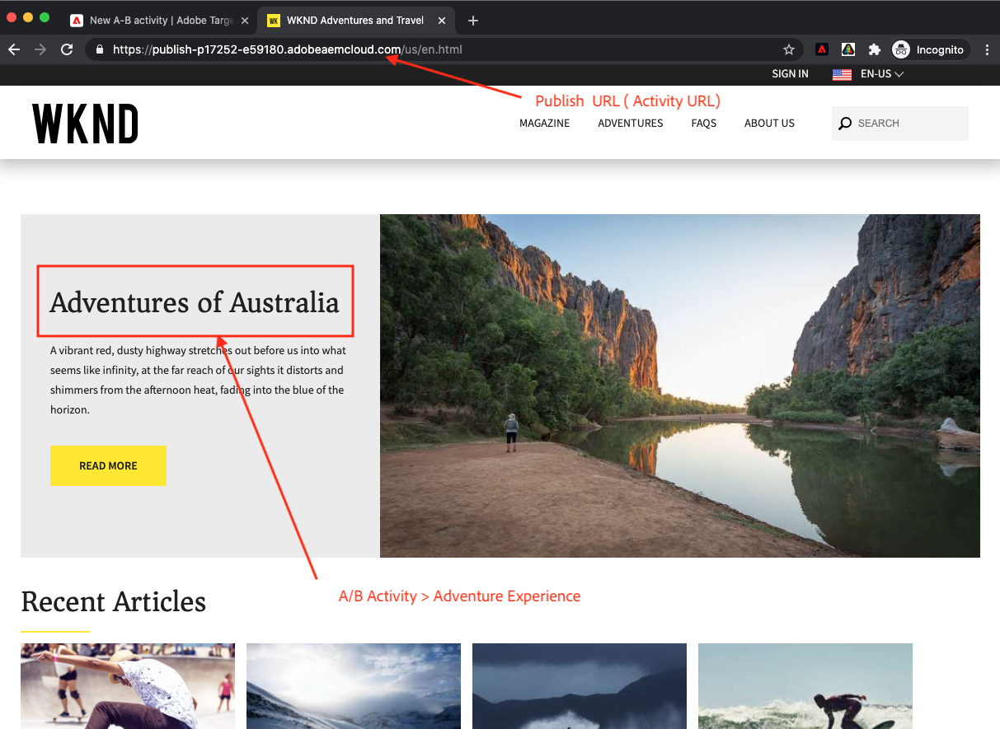

# Personalisering med Visual Experience Composer {#personalization-vec}

Lär dig hur du skapar en A/B Test Target-aktivitet med Visual Experience Composer (VEC).

## Förutsättningar

För att kunna använda VEC på en AEM webbplats måste följande konfiguration vara slutförd:

1. [Lägg till Adobe Target på din AEM webbplats](./add-target-launch-extension.md)
1. [Utlös ett Adobe Target-samtal från taggar](./load-and-fire-target.md)

## Scenarioöversikt

På WKND-webbplatsens hemsida visas lokala aktiviteter eller de bästa sakerna att göra runt en stad i form av informationskort. Som marknadsförare har du tilldelats uppgiften att ändra hemsidan genom att göra textändringar i äventyrsavsnittet och förstå hur konverteringen förbättras.

## Steg för att skapa ett A/B-test med Visual Experience Composer (VEC)

1. Logga in på [Adobe Experience Cloud](https://experience.adobe.com/), tryck på __Mål__, navigera till __Verksamhet__ tab

   + Om du inte ser __Mål__ Kontrollera att rätt Adobe-organisation har valts i organisationsväljaren i det övre högra hörnet på kontrollpanelen Experience Cloud och att användaren har beviljats åtkomst till Target i [Adobe Admin Console](https://adminconsole.adobe.com/).

1. Klicka **Skapa aktivitet** och sedan välja **A/B-test** aktivitet

   

1. Välj **Visual Experience Composer** anger du aktivitets-URL:en och klickar sedan på **Nästa**

   

1. I Visual Experience Composer visas två flikar till vänster när du har skapat en aktivitet: *Upplevelse A* och *Upplevelse B*. Välj en upplevelse i listan. Du kan lägga till nya upplevelser i listan med hjälp av **Lägg till upplevelse** -knappen.

   

1. Markera en bild eller text på sidan som du vill börja ändra, eller använd kodredigeraren för att välja och använda elementet HTML.

   

1. Ändra texten från *Camping i Western Australia* till *Australiens äventyr*. En lista över ändringar som har lagts till i en upplevelse visas under Ändringar. Du kan klicka på och redigera det ändrade objektet för att visa dess CSS-väljare och det nya innehållet som lagts till i det.

   

1. Byt namn *Upplevelse A* till *Adventure*
1. Uppdatera texten på samma sätt *Upplevelse B* från *Camping i Western Australia* till *Utforska Australiens vildhet*.

   

1. Klicka **Nästa** för att gå över till Targeting och vi behåller en manuell trafiktilldelning på 50-50 mellan de två upplevelserna.

   

1. För Mål och inställningar väljer du Rapporteringskällan som Adobe Target och väljer Mått som konvertering med en sidvisningsåtgärd.

   

1. Ange ett namn för aktiviteten och Spara.
1. Aktivera den sparade aktiviteten för att göra ändringarna tillgängliga.

   

1. Öppna din webbplatssida (Aktivitets-URL från steg 3) på en ny flik och du bör kunna visa någon av upplevelserna (Adventure eller Explore) från vår A/B-testaktivitet.

   

## Sammanfattning

I det här kapitlet kunde en marknadsförare skapa en upplevelse med Visual Experience Composer genom att dra och släppa, byta och ändra layouten och innehållet på en webbsida utan att ändra någon kod för att köra ett test.

## Stödlänkar

+ [Adobe Experience Cloud Debugger - Chrome](https://chrome.google.com/webstore/detail/adobe-experience-platform/bfnnokhpnncpkdmbokanobigaccjkpob)
