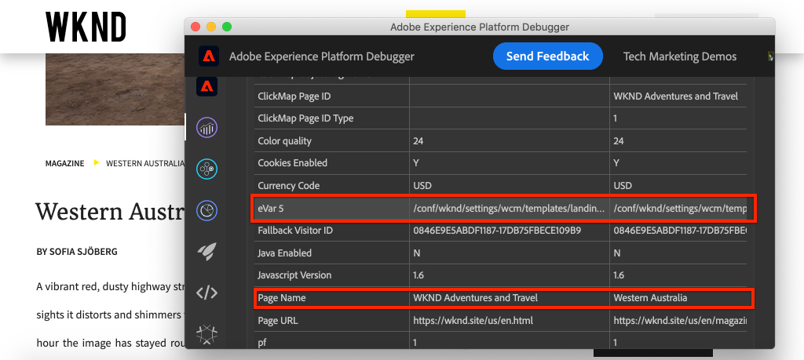
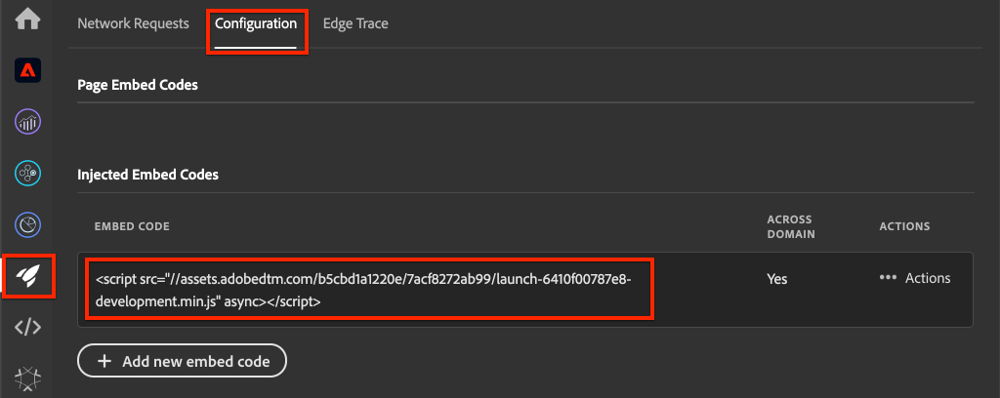
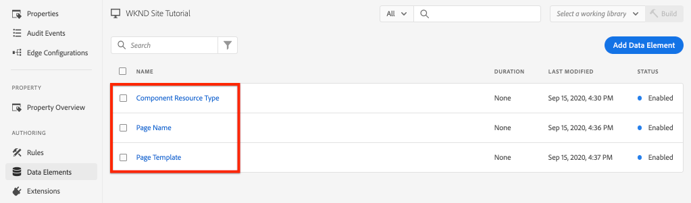

# Integrera AEM Sites och Adobe Analytics

Lär dig hur du integrerar AEM Sites och Adobe Analytics med Adobe Analytics-taggtillägg med hjälp av de inbyggda funktionerna i [Adobe Client Data Layer med AEM Core Components](https://experienceleague.adobe.com/docs/experience-manager-core-components/using/developing/data-layer/overview.html) för att samla in data om en sida i Adobe Experience Manager Sites. [Taggar i Experience Platform](https://experienceleague.adobe.com/docs/experience-platform/tags/home.html) och [Adobe Analytics-tillägget](https://experienceleague.adobe.com/docs/experience-platform/tags/extensions/client/analytics/overview.html) används för att skapa regler för att skicka siddata till Adobe Analytics.

## Vad du ska bygga {#what-build}



I den här självstudiekursen kommer du att utlösa en taggregel baserat på en händelse från Adobe Client Data Layer. Lägg också till villkor för när regeln ska utlösas och skicka sedan värdena **Sidnamn** och **Sidmall** för en AEM-sida till Adobe Analytics.

### Mål {#objective}

1. Skapa en händelsestyrd regel i taggegenskapen som hämtar ändringar från datalagret
1. Mappa egenskaper för siddatalager till dataelement i taggegenskapen
1. Samla in och skicka siddata till Adobe Analytics med hjälp av sidvisningsknappen

## Förutsättningar

Följande krävs:

* **Taggegenskap** i Experience Platform
* **Adobe Analytics** test-/dev-rapportsprogram-ID och spårningsserver. I följande dokumentation finns information om hur du [skapar en rapportsvit](https://experienceleague.adobe.com/docs/analytics/admin/admin-tools/manage-report-suites/c-new-report-suite/new-report-suite.html).
* Webbläsartillägget [Experience Platform Debugger](https://experienceleague.adobe.com/docs/platform-learn/data-collection/debugger/overview.html). Skärmbilder i den här självstudiekursen som tagits från Chrome webbläsare.
* (Valfritt) AEM Site med [Adobe Client Data Layer aktiverat](https://experienceleague.adobe.com/docs/experience-manager-core-components/using/developing/data-layer/overview.html#installation-activation). I den här självstudien används den offentliga [WKND](https://wknd.site/us/en.html)-webbplatsen, men du får använda din egen webbplats.

>[!NOTE]
>
> Behöver du hjälp med att integrera taggegenskap och AEM webbplats? [Se den här videoserien](../experience-platform/data-collection/tags/overview.md).

## Byt taggmiljö för WKND-plats

[WKND](https://wknd.site/us/en.html) är en offentlig webbplats som byggts utifrån [ett öppen källkodsprojekt](https://github.com/adobe/aem-guides-wknd) som utformats som referens och [självstudiekurs](https://experienceleague.adobe.com/docs/experience-manager-learn/getting-started-wknd-tutorial-develop/overview.html) för en AEM-implementering.

I stället för att konfigurera en AEM-miljö och installera WKND-kodbasen kan du använda Experience Platform debugger för att **växla** den aktiva [WKND-platsen](https://wknd.site/us/en.html) till *din* -taggegenskap. Du kan dock använda din egen AEM-webbplats om den redan har [Adobe Client Data Layer aktiverat](https://experienceleague.adobe.com/docs/experience-manager-core-components/using/developing/data-layer/overview.html#installation-activation).

1. Logga in på Experience Platform och [skapa en taggegenskap](https://experienceleague.adobe.com/docs/platform-learn/implement-in-websites/configure-tags/create-a-property.html) (om du inte redan gjort det).
1. Kontrollera att en inledande tagg för JavaScript [bibliotek har skapats](https://experienceleague.adobe.com/docs/experience-platform/tags/publish/libraries.html#create-a-library) och befordrats till taggen [environment](https://experienceleague.adobe.com/docs/experience-platform/tags/publish/environments/environments.html).
1. Kopiera JavaScript inbäddningskod från den taggmiljö där ditt bibliotek har publicerats.

   

1. Öppna en ny flik i webbläsaren och gå till [WKND-platsen](https://wknd.site/us/en.html)
1. Öppna webbläsartillägget Experience Platform Debugger

   

1. Navigera till **Experience Platform-taggar** > **Konfiguration** och under **Inmatade inbäddningskoder** ersätt den befintliga inbäddningskoden med *din* inbäddningskod som kopierats från steg 3.

   

1. Aktivera **Konsolloggning** och **Lås** felsökningsprogrammet på fliken WKND.

   

## Verifiera Adobe klientdatalager på WKND-plats

[WKND-referensprojektet](https://github.com/adobe/aem-guides-wknd) har byggts med AEM Core-komponenter och [Adobe Client Data Layer är aktiverat](https://experienceleague.adobe.com/docs/experience-manager-core-components/using/developing/data-layer/overview.html#installation-activation) som standard. Kontrollera sedan att Adobe Client Data Layer är aktiverat.

1. Navigera till [WKND-plats](https://wknd.site/us/en.html).
1. Öppna webbläsarens utvecklarverktyg och gå till **konsolen**. Kör följande kommando:

   ```js
   adobeDataLayer.getState();
   ```

   Ovanför kod returnerar det aktuella läget för Adobe Client Data Layer.

   

1. Expandera svaret och inspektera posten `page`. Du bör se ett dataschema som följande:

   ```json
   page-2eee4f8914:
       @type: "wknd/components/page"
       dc:description: WKND is a collective of outdoors, music, crafts, adventure sports, and travel enthusiasts that want to share our experiences, connections, and expertise with the world.
       dc:title: "WKND Adventures and Travel"
       repo:modifyDate: "2020-08-31T21:02:21Z"
       repo:path: "/content/wknd/us/en.html"
       xdm:language: "en-US"
       xdm:tags: ["Attract"]
       xdm:template: "/conf/wknd/settings/wcm/templates/landing-page-template"
   ```

   Om du vill skicka siddata till Adobe Analytics använder vi standardegenskaperna `dc:title`, `xdm:language` och `xdm:template` för datalagret.

   Mer information finns i [sidschemat](https://experienceleague.adobe.com/docs/experience-manager-core-components/using/developing/data-layer/overview.html#page) från huvudkomponentens datamodeller.

   >[!NOTE]
   >
   > Om du inte ser JavaScript-objektet `adobeDataLayer`? Kontrollera att [Adobe-klientdatalagret har aktiverats](https://experienceleague.adobe.com/docs/experience-manager-core-components/using/developing/data-layer/overview.html#installation-activation) på din plats.

## Skapa en inläst sidregel

Adobe-klientdatalagret är ett **händelsestyrt** datalager. När datalagret för AEM Page har lästs in utlöses en `cmp:show`-händelse. Skapa en regel som aktiveras när händelsen `cmp:show` utlöses från siddatalagret.

1. Navigera till Experience Platform och till taggegenskapen som är integrerad med AEM Site.
1. Navigera till avsnittet **Regler** i gränssnittet för taggegenskaper och klicka sedan på **Skapa ny regel**.

   

1. Namnge regeln **Sida inläst**.
1. Klicka på **Lägg till** i underavsnittet **Händelser** för att öppna guiden **Händelsekonfiguration**.
1. För fältet **Händelsetyp** väljer du **Egen kod**.

   

1. Klicka på **Öppna redigeraren** i huvudpanelen och ange följande kodfragment:

   ```js
   var pageShownEventHandler = function(evt) {
      // defensive coding to avoid a null pointer exception
      if(evt.hasOwnProperty("eventInfo") && evt.eventInfo.hasOwnProperty("path")) {
         //trigger the Tag Rule and pass event
         console.log("cmp:show event: " + evt.eventInfo.path);
         var event = {
            //include the path of the component that triggered the event
            path: evt.eventInfo.path,
            //get the state of the component that triggered the event
            component: window.adobeDataLayer.getState(evt.eventInfo.path)
         };
   
         //Trigger the Tag Rule, passing in the new `event` object
         // the `event` obj can now be referenced by the reserved name `event` by other Tag data elements
         // i.e `event.component['someKey']`
         trigger(event);
      }
   }
   
   //set the namespace to avoid a potential race condition
   window.adobeDataLayer = window.adobeDataLayer || [];
   //push the event listener for cmp:show into the data layer
   window.adobeDataLayer.push(function (dl) {
      //add event listener for `cmp:show` and callback to the `pageShownEventHandler` function
      dl.addEventListener("cmp:show", pageShownEventHandler);
   });
   ```

   Ovanstående kodfragment lägger till en händelseavlyssnare genom att [överföra en funktion](https://github.com/adobe/adobe-client-data-layer/wiki#pushing-a-function) till datalagret. När händelsen `cmp:show` aktiveras anropas funktionen `pageShownEventHandler`. I den här funktionen läggs några säkerhetskontroller till och en ny `event` skapas med det senaste [-läget för datalagret ](https://github.com/adobe/adobe-client-data-layer/wiki#getstate) för komponenten som utlöste händelsen.

   Slutligen anropas funktionen `trigger(event)`. Funktionen `trigger()` är ett reserverat namn i taggegenskapen och den **utlöser** regeln. Objektet `event` skickas som en parameter som i sin tur visas med ett annat reserverat namn i taggegenskapen. Dataelement i taggegenskapen kan nu referera till olika egenskaper med kodfragment som `event.component['someKey']`.

1. Spara ändringarna.
1. Klicka på **Lägg till** under **Åtgärder** för att öppna guiden **Åtgärdskonfiguration**.
1. Välj **Anpassad kod** för fältet **Åtgärdstyp**.

   

1. Klicka på **Öppna redigeraren** i huvudpanelen och ange följande kodfragment:

   ```js
   console.log("Page Loaded ");
   console.log("Page name: " + event.component['dc:title']);
   console.log("Page type: " + event.component['@type']);
   console.log("Page template: " + event.component['xdm:template']);
   ```

   Objektet `event` skickas från metoden `trigger()` som anropas i den anpassade händelsen. Här är `component` den aktuella sidan som härleds från datalagret `getState` i den anpassade händelsen.

1. Spara ändringarna och kör en [build](https://experienceleague.adobe.com/docs/experience-platform/tags/publish/builds.html) i taggegenskapen för att marknadsföra koden till den [miljö](https://experienceleague.adobe.com/docs/experience-platform/tags/publish/environments/environments.html) som används på din AEM-webbplats.

   >[!NOTE]
   >
   > Det kan vara användbart att använda [Adobe Experience Platform Debugger](https://experienceleague.adobe.com/docs/platform-learn/data-collection/debugger/overview.html) för att växla inbäddningskoden till en **Development** -miljö.

1. Navigera till din AEM-webbplats och öppna utvecklarverktygen för att visa konsolen. Uppdatera sidan så ser du att konsolmeddelandena har loggats:


## Skapa dataelement

Skapa sedan flera dataelement för att hämta olika värden från Adobe klientdatalager. Som du såg i föregående övning är det möjligt att komma åt egenskaperna för datalagret direkt via anpassad kod. Fördelen med att använda dataelement är att de kan återanvändas i alla taggregler.

Dataelement mappas till egenskaperna `@type`, `dc:title` och `xdm:template`.

### Komponentresurstyp

1. Navigera till Experience Platform och till taggegenskapen som är integrerad med AEM Site.
1. Navigera till avsnittet **Dataelement** och klicka på **Skapa nytt dataelement**.
1. Ange **komponentresurstypen** för fältet **Namn**.
1. Välj **Anpassad kod** för fältet **Dataelementtyp**.

   

1. Klicka på knappen **Öppna redigeraren** och ange följande i den anpassade kodredigeraren:

   ```js
   if(event && event.component && event.component.hasOwnProperty('@type')) {
       return event.component['@type'];
   }
   ```

1. Spara ändringarna.

   >[!NOTE]
   >
   > Kom ihåg att objektet `event` görs tillgängligt och omfång baserat på händelsen som utlöste egenskapen **Rule** i tagg. Värdet för ett dataelement anges inte förrän dataelementet är *refererat* i en regel. Det är därför säkert att använda det här dataelementet i en regel som **Sidinläsning** som skapades i föregående steg *, men* skulle inte vara säker att använda i andra sammanhang.

### Sidnamn

1. Klicka på knappen **Lägg till dataelement**
1. Ange **Sidnamn** för fältet **Namn**.
1. Välj **Anpassad kod** för fältet **Dataelementtyp**.
1. Klicka på knappen **Öppna redigeraren** och ange följande i den anpassade kodredigeraren:

   ```js
   if(event && event.component && event.component.hasOwnProperty('dc:title')) {
       return event.component['dc:title'];
   }
   ```

1. Spara ändringarna.

### Sidmall

1. Klicka på knappen **Lägg till dataelement**
1. Ange **Sidmall** för fältet **Namn**.
1. Välj **Anpassad kod** för fältet **Dataelementtyp**.
1. Klicka på knappen **Öppna redigeraren** och ange följande i den anpassade kodredigeraren:

   ```js
   if(event && event.component && event.component.hasOwnProperty('xdm:template')) {
       return event.component['xdm:template'];
   }
   ```

1. Spara ändringarna.

1. Du bör nu ha tre dataelement som en del av din regel:

   

## Lägg till analystillägget

Lägg sedan till Analytics-tillägget i taggegenskapen för att skicka data till en rapportserie.

1. Navigera till Experience Platform och till taggegenskapen som är integrerad med AEM Site.
1. Gå till **Tillägg** > **Katalog**
1. Leta reda på tillägget **Adobe Analytics** och klicka på **Installera**

   

1. Under **Bibliotekshantering** > **Rapportsviter** anger du de ID:n för rapportsviten som du vill använda för varje taggmiljö.

   

   >[!NOTE]
   >
   > Det går bra att använda en rapportserie för alla miljöer i den här självstudiekursen, men i verkligheten vill du använda separata rapportsviter, som bilden nedan visar

   >[!TIP]
   >
   >Vi rekommenderar att du använder alternativet *Hantera biblioteket åt mig* som inställning för bibliotekshantering eftersom det gör det mycket enklare att hålla `AppMeasurement.js`-biblioteket uppdaterat.

1. Markera kryssrutan för att aktivera **Använd Activity Map**.

   

1. Under **Allmänt** > **Spårningsserver** anger du spårningsservern, till exempel `tmd.sc.omtrdc.net`. Ange din SSL-spårningsserver om din webbplats stöder `https://`

   

1. Klicka på **Spara** för att spara ändringarna.

## Lägga till ett villkor i regeln Sidinläst

Uppdatera sedan regeln **Sida inläst** så att dataelementet **Komponentresurstyp** används, så att regeln bara aktiveras när händelsen `cmp:show` gäller för **sidan**. Andra komponenter kan utlösa händelsen `cmp:show`, till exempel utlöses den av komponenten Carousel när bildrutorna ändras. Därför är det viktigt att lägga till ett villkor för den här regeln.

1. Navigera till regeln **Sidinläsning** som skapades tidigare i gränssnittet för taggegenskaper.
1. Under **Villkor** klickar du på **Lägg till** för att öppna guiden **Konfiguration av villkor**.
1. Välj alternativet **Värdejämförelse** för fältet **Villkorstyp**.
1. Ange det första värdet i formulärfältet till `%Component Resource Type%`. Du kan använda dataelementikonen  för att välja dataelementet **Component Resource Type** . Låt jämförelseobjektet vara `Equals`.
1. Ange det andra värdet som `wknd/components/page`.

   

   >[!NOTE]
   >
   > Det går att lägga till det här villkoret i den anpassade kodfunktionen som avlyssnar händelsen `cmp:show` som skapades tidigare i självstudien. Om du lägger till den i användargränssnittet blir den synligare för ytterligare användare som kan behöva göra ändringar i regeln. Dessutom kan vi använda vårt dataelement!

1. Spara ändringarna.

## Ange analysvariabler och aktivera sidvisningsfunktionen

Regeln **Sidinläsning** visar för närvarande bara en konsolsats. Använd sedan dataelementen och Analytics-tillägget för att ange Analytics-variabler som en **åtgärd** i regeln **Inläst sida**. Vi har också ställt in en extra åtgärd för att utlösa **sidvisningsBeacon** och skicka insamlade data till Adobe Analytics.

1. **Ta bort** åtgärden **Core - Custom Code** (konsolprogramsatserna) i regeln för sidinläsning: Ta bort: Core - Custom Code:

   

1. Klicka på **Lägg till** under åtgärdsunderavsnittet för att lägga till en ny åtgärd.

1. Ange typen **Tillägg** till **Adobe Analytics** och ställ in **Åtgärdstyp** till **Ange variabler**

   

1. Markera en tillgänglig **eVar** på huvudpanelen och ange som värde för dataelementets **sidmall**. Använd ikonen  för att välja elementet **Sidmall**.

   

1. Bläddra nedåt, under **Ytterligare inställningar** ange **Sidnamn** till dataelementet **Sidnamn**:

   

1. Spara ändringarna.

1. Lägg sedan till en extra åtgärd till höger om **Adobe Analytics - Ange variabler** genom att trycka på ikonen **plus** :

   

1. Ange typen **Tillägg** till **Adobe Analytics** och ställ in **åtgärdstypen** till **Skicka Beacon**. Eftersom den här åtgärden betraktas som en sidvy låter du standardspårningsinställningen vara **`s.t()`**.

   

1. Spara ändringarna. Regeln **Sidinläsning** bör nu ha följande konfiguration:

   

   * **1.** Lyssna efter händelsen `cmp:show`.
   * **2.** Kontrollera att händelsen utlöstes av en sida.
   * **3.** Ange analysvariabler för **Sidnamn** och **Sidmall**
   * **4.** Skicka analyssidans vy

1. Spara alla ändringar och bygg ditt taggbibliotek och marknadsför till rätt miljö.

## Validera sidvyns beacon- och analysanrop

Nu när regeln **Sidinläsning** skickar analysfyren bör du kunna se analysspårningsvariablerna med Experience Platform Debugger.

1. Öppna [WKND-platsen](https://wknd.site/us/en.html) i webbläsaren.
1. Klicka på felsökningsikonen  för att öppna Experience Platform Debugger.
1. Kontrollera att felsökaren mappar taggegenskapen till *din*-utvecklingsmiljö, enligt beskrivningen ovan, och att **Konsolloggning** är markerad.
1. Öppna Analytics-menyn och kontrollera att rapportsviten är inställd på *din*-rapportsvit. Sidnamnet ska också fyllas i:

   

1. Bläddra nedåt och expandera **Nätverksförfrågningar**. Du bör kunna hitta uppsättningen **evar** för **sidmallen**:

   

1. Gå tillbaka till webbläsaren och öppna utvecklarkonsolen. Klicka igenom **Carousel** överst på sidan.

   

1. Observera följande i webbläsarkonsolen:

   

   Detta beror på att Carousel utlöser en `cmp:show`-händelse *, men* på grund av vår kontroll av **komponentresurstypen** utlöses ingen händelse.

   >[!NOTE]
   >
   > Om du inte ser några konsolloggar kontrollerar du att **Konsolloggning** finns under **Experience Platform-taggar** i Experience Platform Debugger.

1. Navigera till en artikelsida som [Western Australia](https://wknd.site/us/en/magazine/western-australia.html). Lägg märke till att sidnamnet och malltypen ändras.

## Grattis!

Du har precis använt det händelsestyrda Adobe Client Data Layer and Tags i Experience Platform för att samla in data från en AEM-webbplats och skicka dem till Adobe Analytics.

### Nästa steg

Titta på följande självstudiekurs för att lära dig hur du använder det händelsestyrda Adobe Client Data-lagret för att [spåra klickningar på specifika komponenter på en Adobe Experience Manager-webbplats](track-clicked-component.md).
