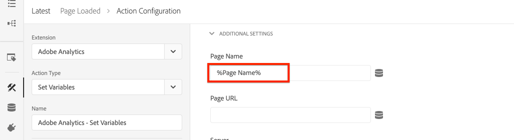

# Integrera AEM Sites och Adobe Analytics

>[!NOTE]
>
>Adobe Experience Platform Launch har omklassificerats som en serie datainsamlingstekniker i Adobe Experience Platform. Som ett resultat av detta har flera terminologiska förändringar införts i produktdokumentationen. Se följande [dokument](https://experienceleague.adobe.com/docs/experience-platform/tags/term-updates.html) för en konsoliderad hänvisning till terminologiska förändringar.


Lär dig hur du integrerar AEM Sites och Adobe Analytics med Adobe Analytics-taggtillägg med hjälp av de inbyggda funktionerna i [Adobe Client Data Layer med AEM Core Components](https://experienceleague.adobe.com/docs/experience-manager-core-components/using/developing/data-layer/overview.html) för att samla in data om en sida i Adobe Experience Manager Sites. [Taggar i Experience Platform](https://experienceleague.adobe.com/docs/experience-platform/tags/home.html) och [Adobe Analytics-tillägg](https://experienceleague.adobe.com/docs/experience-platform/tags/extensions/client/analytics/overview.html) används för att skapa regler för att skicka siddata till Adobe Analytics.

## Vad du ska bygga {#what-build}


I den här självstudiekursen kommer du att utlösa en taggregel baserat på en händelse från Adobe-klientdatalagret. Lägg också till villkor för när regeln ska aktiveras och skicka sedan **Sidnamn** och **Sidmall** värden för en AEM till Adobe Analytics.

### Mål {#objective}

1. Skapa en händelsestyrd regel i taggegenskapen som hämtar ändringar från datalagret
1. Mappa egenskaper för siddatalager till dataelement i taggegenskapen
1. Samla in och skicka siddata till Adobe Analytics med hjälp av sidvisningsknappen

## Förutsättningar

Följande krävs:

* **Tagg, egenskap** i EXPERIENCE PLATFORM
* **Adobe Analytics** test/dev report suite ID and tracking server. Se följande dokumentation för [skapa en rapportsvit](https://experienceleague.adobe.com/docs/analytics/admin/admin-tools/manage-report-suites/c-new-report-suite/new-report-suite.html).
* [Felsökning för Experience Platform](https://experienceleague.adobe.com/docs/platform-learn/data-collection/debugger/overview.html) webbläsartillägg. Skärmbilder i den här självstudiekursen som tagits från webbläsaren Chrome.
* (Valfritt) AEM webbplatsen med [Adobe Client Data Layer är aktiverat](https://experienceleague.adobe.com/docs/experience-manager-core-components/using/developing/data-layer/overview.html#installation-activation). I den här självstudiekursen används den offentliga sidan [WKND](https://wknd.site/us/en.html) -sajten, men du får använda din egen sajt.

>[!NOTE]
>
> Behöver du hjälp med att integrera taggegenskap och AEM? [Se den här videoserien](../experience-platform/data-collection/tags/overview.md).

## Byt taggmiljö för WKND-plats

The [WKND](https://wknd.site/us/en.html) är en publik webbplats som bygger på [ett öppen källkodsprojekt](https://github.com/adobe/aem-guides-wknd) som utformats som referens och [självstudiekurs](https://experienceleague.adobe.com/docs/experience-manager-learn/getting-started-wknd-tutorial-develop/overview.html) för en AEM implementering.

I stället för att konfigurera en AEM miljö och installera WKND-kodbasen kan du använda felsökningsprogrammet Experience Platform för att **switch** live [WKND-plats](https://wknd.site/us/en.html) till *din* taggegenskap. Du kan dock använda en egen AEM om den redan har [Adobe Client Data Layer är aktiverat](https://experienceleague.adobe.com/docs/experience-manager-core-components/using/developing/data-layer/overview.html#installation-activation).

1. Logga in på Experience Platform och [skapa en taggegenskap](https://experienceleague.adobe.com/docs/platform-learn/implement-in-websites/configure-tags/create-a-property.html) (om du inte redan gjort det).
1. Se till att JavaScript-taggen är den första [biblioteket har skapats](https://experienceleague.adobe.com/docs/experience-platform/tags/publish/libraries.html#create-a-library) och framhävd till taggen [miljö](https://experienceleague.adobe.com/docs/experience-platform/tags/publish/environments/environments.html).
1. Kopiera JavaScript-inbäddningskoden från den taggmiljö där biblioteket har publicerats.

   

1. Öppna en ny flik i webbläsaren och gå till [WKND-plats](https://wknd.site/us/en.html)
1. Öppna webbläsartillägget Experience Platform Debugger

   

1. Navigera till **Experience Platform-taggar** > **Konfiguration** och under **Inmatade inbäddade koder** ersätta den befintliga inbäddningskoden med *din* inbäddningskod kopierad från steg 3.

   

1. Aktivera **Konsolloggning** och **Lås** felsökaren på fliken WKND.

   

## Verifiera Adobe klientdatalager på WKND-plats

The [WKND-referensprojekt](https://github.com/adobe/aem-guides-wknd) byggs med AEM kärnkomponenter och har [Adobe Client Data Layer är aktiverat](https://experienceleague.adobe.com/docs/experience-manager-core-components/using/developing/data-layer/overview.html#installation-activation) som standard. Kontrollera sedan att datalagret för klienten i Adobe är aktiverat.

1. Navigera till [WKND-plats](https://wknd.site/us/en.html).
1. Öppna webbläsarens utvecklarverktyg och gå till **Konsol**. Kör följande kommando:

   ```js
   adobeDataLayer.getState();
   ```

   Ovanför kod returnerar det aktuella läget för Adobe-klientdatalagret.

   

1. Expandera svaret och inspektera `page` post. Du bör se ett dataschema som följande:

   ```json
   page-2eee4f8914:
       @type: "wknd/components/page"
       dc:description: WKND is a collective of outdoors, music, crafts, adventure sports, and travel enthusiasts that want to share our experiences, connections, and expertise with the world.
       dc:title: "WKND Adventures and Travel"
       repo:modifyDate: "2020-08-31T21:02:21Z"
       repo:path: "/content/wknd/us/en.html"
       xdm:language: "en-US"
       xdm:tags: ["Attract"]
       xdm:template: "/conf/wknd/settings/wcm/templates/landing-page-template"
   ```

   Om du vill skicka siddata till Adobe Analytics använder vi standardegenskaperna som `dc:title`, `xdm:language`och `xdm:template` av datalagret.

   Mer information finns i [Sidschema](https://experienceleague.adobe.com/docs/experience-manager-core-components/using/developing/data-layer/overview.html#page) från de grundläggande komponenternas datascheman.

   >[!NOTE]
   >
   > Om du inte ser `adobeDataLayer` JavaScript-objekt? Se till att [Adobe-klientdatalagret har aktiverats](https://experienceleague.adobe.com/docs/experience-manager-core-components/using/developing/data-layer/overview.html#installation-activation) på din webbplats.

## Skapa en inläst sidregel

Adobe-klientdatalagret är ett **händelsestyrd** datalager. När AEM siddatalager läses in utlöses en `cmp:show` -händelse. Skapa en regel som aktiveras när `cmp:show` händelsen utlöses från siddatalagret.

1. Navigera till Experience Platform och till taggegenskapen som är integrerad med AEM.
1. Navigera till **Regler** i taggegenskapsgränssnittet och klicka sedan på **Skapa ny regel**.

   

1. Namnge regeln **Inläst sida**.
1. I **Händelser** undersektion, klicka **Lägg till** för att öppna **Händelsekonfiguration** guide.
1. För **Händelsetyp** fält, markera **Egen kod**.

   

1. Klicka **Öppna redigeraren** i huvudpanelen och ange följande kodfragment:

   ```js
   var pageShownEventHandler = function(evt) {
      // defensive coding to avoid a null pointer exception
      if(evt.hasOwnProperty("eventInfo") && evt.eventInfo.hasOwnProperty("path")) {
         //trigger the Tag Rule and pass event
         console.log("cmp:show event: " + evt.eventInfo.path);
         var event = {
            //include the path of the component that triggered the event
            path: evt.eventInfo.path,
            //get the state of the component that triggered the event
            component: window.adobeDataLayer.getState(evt.eventInfo.path)
         };
   
         //Trigger the Tag Rule, passing in the new `event` object
         // the `event` obj can now be referenced by the reserved name `event` by other Tag data elements
         // i.e `event.component['someKey']`
         trigger(event);
      }
   }
   
   //set the namespace to avoid a potential race condition
   window.adobeDataLayer = window.adobeDataLayer || [];
   //push the event listener for cmp:show into the data layer
   window.adobeDataLayer.push(function (dl) {
      //add event listener for `cmp:show` and callback to the `pageShownEventHandler` function
      dl.addEventListener("cmp:show", pageShownEventHandler);
   });
   ```

   Ovanstående kodfragment lägger till en händelseavlyssnare med [trycka en funktion](https://github.com/adobe/adobe-client-data-layer/wiki#pushing-a-function) till datalagret. När `cmp:show` -händelsen aktiveras `pageShownEventHandler` funktionen anropas. I den här funktionen läggs några säkerhetskontroller till och en ny `event` är konstruerad med den senaste [datalagrets läge](https://github.com/adobe/adobe-client-data-layer/wiki#getstate) för komponenten som utlöste händelsen.

   Äntligen `trigger(event)` funktionen anropas. The `trigger()` funktionen är ett reserverat namn i taggegenskapen och den **utlösare** regeln. The `event` objektet skickas som en parameter som i sin tur visas med ett annat reserverat namn i taggegenskapen. Dataelement i taggegenskapen kan nu referera till olika egenskaper med hjälp av kodfragment som `event.component['someKey']`.

1. Spara ändringarna.
1. Nästa under **Åtgärder** klicka **Lägg till** för att öppna **Åtgärdskonfiguration** guide.
1. För **Åtgärdstyp** fält, välj **Egen kod**.

   

1. Klicka **Öppna redigeraren** i huvudpanelen och ange följande kodfragment:

   ```js
   console.log("Page Loaded ");
   console.log("Page name: " + event.component['dc:title']);
   console.log("Page type: " + event.component['@type']);
   console.log("Page template: " + event.component['xdm:template']);
   ```

   The `event` objektet skickas från `trigger()` metoden anropas i den anpassade händelsen. Här är `component` är den aktuella sidan som härleds från datalagret `getState` i den anpassade händelsen.

1. Spara ändringarna och kör en [bygg](https://experienceleague.adobe.com/docs/experience-platform/tags/publish/builds.html) i tagg-egenskapen för att höja upp koden för [miljö](https://experienceleague.adobe.com/docs/experience-platform/tags/publish/environments/environments.html) som används på din AEM.

   >[!NOTE]
   >
   > Det kan vara användbart att använda [Adobe Experience Platform Debugger](https://experienceleague.adobe.com/docs/platform-learn/data-collection/debugger/overview.html) för att växla inbäddningskoden till en **Utveckling** miljö.

1. Navigera till AEM webbplats och öppna utvecklarverktygen för att visa konsolen. Uppdatera sidan så ser du att konsolmeddelandena har loggats:


## Skapa dataelement

Skapa sedan flera dataelement för att hämta olika värden från datalagret för klienten i Adobe. Som du såg i föregående övning är det möjligt att komma åt egenskaperna för datalagret direkt via anpassad kod. Fördelen med att använda dataelement är att de kan återanvändas i alla taggregler.

Dataelement mappas till `@type`, `dc:title`och `xdm:template` egenskaper.

### Komponentresurstyp

1. Navigera till Experience Platform och till taggegenskapen som är integrerad med AEM.
1. Navigera till **Dataelement** och klicka **Skapa nytt dataelement**.
1. För **Namn** fält, ange **Komponentresurstyp**.
1. För **Dataelementtyp** fält, markera **Egen kod**.

   

1. Klicka **Öppna redigeraren** och ange följande i den anpassade kodredigeraren:

   ```js
   if(event && event.component && event.component.hasOwnProperty('@type')) {
       return event.component['@type'];
   }
   ```

1. Spara ändringarna.

   >[!NOTE]
   >
   > Kom ihåg att `event` objektet görs tillgängligt och omfång baserat på den händelse som utlöste **Regel** in-taggegenskap. Värdet för ett dataelement anges inte förrän dataelementet är *refererad* inom en regel. Därför är det säkert att använda det här dataelementet i en regel som **Inläst sida** regel som skapades i föregående steg *men* inte är säkert att använda i andra sammanhang.

### Sidnamn

1. Klicka **Lägg till dataelement** knapp
1. För **Namn** fält, ange **Sidnamn**.
1. För **Dataelementtyp** fält, markera **Egen kod**.
1. Klicka **Öppna redigeraren** och ange följande i den anpassade kodredigeraren:

   ```js
   if(event && event.component && event.component.hasOwnProperty('dc:title')) {
       return event.component['dc:title'];
   }
   ```

1. Spara ändringarna.

### Sidmall

1. Klicka på **Lägg till dataelement** knapp
1. För **Namn** fält, ange **Sidmall**.
1. För **Dataelementtyp** fält, markera **Egen kod**.
1. Klicka **Öppna redigeraren** och ange följande i den anpassade kodredigeraren:

   ```js
   if(event && event.component && event.component.hasOwnProperty('xdm:template')) {
       return event.component['xdm:template'];
   }
   ```

1. Spara ändringarna.

1. Du bör nu ha tre dataelement som en del av din regel:

   

## Lägg till analystillägget

Lägg sedan till Analytics-tillägget i taggegenskapen för att skicka data till en rapportserie.

1. Navigera till Experience Platform och till taggegenskapen som är integrerad med AEM.
1. Gå till **Tillägg** > **Katalog**
1. Leta reda på **Adobe Analytics** och klicka på **Installera**

   

1. Under **Bibliotekshantering** > **Rapportsviter** anger du de ID:n för rapportsviten som du vill använda för varje taggmiljö.

   

   >[!NOTE]
   >
   > Det går bra att använda en rapportserie för alla miljöer i den här självstudiekursen, men i verkligheten vill du använda separata rapportsviter, som bilden nedan visar

   >[!TIP]
   >
   >Vi rekommenderar *Hantera biblioteket åt mig, alternativ* eftersom bibliotekshanteringen gör det mycket enklare att behålla `AppMeasurement.js` uppdaterat bibliotek.

1. Markera kryssrutan för att aktivera **Använd Activity Map**.

   

1. Under **Allmänt** > **Spårningsserver** anger du till exempel spårningsservern `tmd.sc.omtrdc.net`. Ange din SSL-spårningsserver om din webbplats stöder `https://`

   

1. Klicka **Spara** för att spara ändringarna.

## Lägga till ett villkor i regeln Sidinläst

Uppdatera sedan **Inläst sida** regel som ska använda **Komponentresurstyp** dataelement för att säkerställa att regeln bara aktiveras när `cmp:show` händelsen är för **Sida**. Andra komponenter kan utlösa `cmp:show` -händelsen aktiveras till exempel när bilden ändras. Därför är det viktigt att lägga till ett villkor för den här regeln.

1. I taggegenskapsgränssnittet går du till **Inläst sida** regeln skapades tidigare.
1. Under **Villkor** klicka **Lägg till** för att öppna **Villkorskonfiguration** guide.
1. För **Villkorstyp** fält, markera **Värdejämförelse** alternativ.
1. Ange det första värdet i formulärfältet till `%Component Resource Type%`. Du kan använda ikonen Dataelement  för att välja **Komponentresurstyp** dataelement. Lämna jämförelseinställningen på `Equals`.
1. Ange det andra värdet till `wknd/components/page`.

   

   >[!NOTE]
   >
   > Det går att lägga till det här villkoret i den anpassade kodfunktionen som avlyssnar `cmp:show` händelse som skapades tidigare i självstudien. Om du lägger till den i användargränssnittet blir den synligare för ytterligare användare som kan behöva göra ändringar i regeln. Dessutom kan vi använda vårt dataelement!

1. Spara ändringarna.

## Ange analysvariabler och aktivera sidvisningsfunktionen

För närvarande är **Inläst sida** regeln returnerar bara en konsolsats. Använd sedan dataelementen och Analytics-tillägget för att ange Analytics-variabler som **åtgärd** i **Inläst sida** regel. Vi ställer också in en extra åtgärd för att aktivera **Sidvisningsfyr** och skicka insamlade data till Adobe Analytics.

1. I regeln för sidinläsning **ta bort** den **Core - anpassad kod** åtgärd (konsolprogramsatser):

   

1. Klicka på under underavsnittet Åtgärder **Lägg till** för att lägga till en ny åtgärd.

1. Ange **Tillägg** skriv till **Adobe Analytics** och ange **Åtgärdstyp** till  **Ange variabler**

   

1. Välj en tillgänglig **eVar** och anges som värdet för dataelementet **Sidmall**. Använda ikonen Dataelement  för att välja **Sidmall** -element.

   

1. Bläddra nedåt, under **Ytterligare inställningar** set **Sidnamn** till dataelementet **Sidnamn**:

   

1. Spara ändringarna.

1. Lägg sedan till en extra åtgärd till höger om **Adobe Analytics - Ange variabler** genom att trycka på **plus** ikon:

   

1. Ange **Tillägg** skriv till **Adobe Analytics** och ange **Åtgärdstyp** till  **Skicka Beacon**. Eftersom den här åtgärden betraktas som en sidvy låter du standardspårningsinställningen vara **`s.t()`**.

   

1. Spara ändringarna. The **Inläst sida** regeln ska nu ha följande konfiguration:

   

   * **1.** Lyssna på `cmp:show` -händelse.
   * **2.** Kontrollera att händelsen utlöstes av en sida.
   * **3.** Ange analysvariabler för **Sidnamn** och **Sidmall**
   * **4.** Skicka analyssidans vy

1. Spara alla ändringar och bygg ditt taggbibliotek och marknadsför till rätt miljö.

## Validera sidvyns beacon- och analysanrop

Nu när **Inläst sida** regel skickar analysfyren, så du bör kunna se analysspårningsvariablerna med hjälp av Experience Platform-felsökaren.

1. Öppna [WKND-plats](https://wknd.site/us/en.html) i webbläsaren.
1. Klicka på ikonen Felsökning  för att öppna felsökningsprogrammet för Experience Platform.
1. Kontrollera att felsökaren mappar taggegenskapen till *din* Utvecklingsmiljö, enligt beskrivningen ovan, och **Konsolloggning** är markerad.
1. Öppna Analytics-menyn och kontrollera att rapportsviten är inställd på *din* rapportsvit. Sidnamnet ska också fyllas i:

   

1. Rulla ned och expandera **Nätverksförfrågningar**. Du bör kunna hitta **evar** för **Sidmall**:

   

1. Gå tillbaka till webbläsaren och öppna utvecklarkonsolen. Klicka igenom **Carousel** överst på sidan.

   

1. Observera följande i webbläsarkonsolen:

   

   Det beror på att Carousel utlöser en `cmp:show` event *men* på grund av vår check på **Komponentresurstyp**, ingen händelse utlöses.

   >[!NOTE]
   >
   > Om inga konsolloggar visas kontrollerar du att **Konsolloggning** är incheckad **Experience Platform-taggar** i Experience Platform Debugger.

1. Navigera till en artikelsida som [Western Australia](https://wknd.site/us/en/magazine/western-australia.html). Lägg märke till att sidnamnet och malltypen ändras.

## Grattis!

Du har precis använt det händelsestyrda Adobe-klientdatalagret och -taggarna i Experience Platform för att samla in data från en AEM webbplats och skicka dem till Adobe Analytics.

### Nästa steg

Titta på följande självstudiekurs för att lära dig hur du använder det händelsestyrda Adobe-klientdatalagret för att [spåra klick på specifika komponenter på en Adobe Experience Manager-webbplats](track-clicked-component.md).
