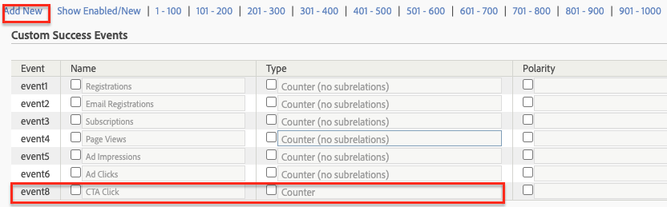
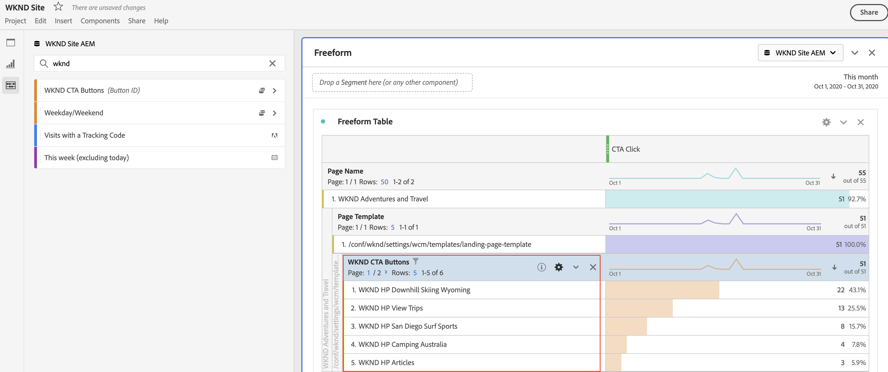

# Analysera data med Analysis Workspace

Läs om hur du mappar data som samlats in från en Adobe Experience Manager-webbplats till mätvärden och dimensioner i Adobe Analytics rapporteringsprogram. Lär dig hur du skapar en detaljerad rapportkontrollpanel med Analysis Workspace-funktionen i Adobe Analytics.

## Vad du ska bygga {#what-build}

WKND:s marknadsföringsteam är intresserade av att veta vilka `Call to Action (CTA)` -knapparna fungerar bäst på hemsidan. I den här självstudiekursen skapar du ett projekt i **Analysis Workspace** för att visualisera prestandan för olika CTA-knappar och förstå användarbeteendet på webbplatsen. Följande information hämtas med Adobe Analytics när en användare klickar på en Call to Action-knapp (CTA) på WKND-hemsidan.

**Analysvariabler**

Nedan följer Analytics-variablerna som för närvarande spåras:

* `eVar5` -  `Page template`
* `eVar6` - `Page Id`
* `eVar7` - `Page last modified date`
* `eVar8` - `CTA Button Id`
* `eVar9` - `Page Name`
* `event8` - `CTA Button Click event`
* `prop8` - `CTA Button Id`

### Mål {#objective}

1. Skapa en rapportsvit eller använd en befintlig.
1. Konfigurera [Konverteringsvariabler (eVars)](https://experienceleague.adobe.com/docs/analytics/admin/admin-tools/manage-report-suites/edit-report-suite/conversion-variables/conversion-var-admin.html) och [Success Events (Events)](https://experienceleague.adobe.com/docs/analytics/admin/admin-tools/manage-report-suites/edit-report-suite/conversion-variables/success-events/success-event.html) i Report Suite.
1. Skapa en [Analysis Workspace-projekt](https://experienceleague.adobe.com/docs/analytics/analyze/analysis-workspace/home.html) att analysera data med hjälp av verktyg som gör det möjligt att snabbt skapa, analysera och dela insikter.
1. Dela Analysis Workspace-projektet med andra teammedlemmar.

## Förutsättningar

Den här självstudiekursen är en fortsättning på [Spåra klickade komponenter med Adobe Analytics](./track-clicked-component.md) och förutsätter att du har:

* A **Taggegenskap** med [Adobe Analytics-tillägg](https://experienceleague.adobe.com/docs/experience-platform/tags/extensions/client/analytics/overview.html) aktiverad
* **Adobe Analytics** test/dev report suite ID and tracking server. Se följande dokumentation för [skapa en rapportsvit](https://experienceleague.adobe.com/docs/analytics/admin/admin-tools/manage-report-suites/c-new-report-suite/new-report-suite.html).
* [Felsökning för Experience Platform](https://experienceleague.adobe.com/docs/platform-learn/data-collection/debugger/overview.html) webbläsartillägget har konfigurerats med en taggegenskap inläst på [WKND-plats](https://wknd.site/us/en.html) eller en AEM med datalagret Adobe aktiverat.

## Konverteringsvariabler (eVars) och lyckade händelser (Event)

Custom Insight Conversion Variable (eller eVar) placeras i Adobe-koden på de webbsidor du har valt. Dess främsta syfte är att segmentera framgångsstatistik för konverteringar i anpassade marknadsföringsrapporter. En eVar kan vara besöksbaserad och fungerar på liknande sätt som cookies. De värden som skickas till eVar-variabler följer efter användaren under en förbestämd period.

När en eVar är inställd på en besökares värde kommer Adobe automatiskt ihåg det värdet tills det upphör att gälla. Alla lyckade händelser som besökaren påträffar när eVarna är aktiv räknas mot eVarna.

eVars är bäst att använda för att mäta orsak och effekt, till exempel:

* Vilka interna kampanjer som påverkade intäkterna
* Vilka banners som till slut resulterade i en registrering
* Antalet gånger som en intern sökning användes innan en order skapades

Success-händelser är åtgärder som kan spåras. Du avgör vilken händelse som lyckas. Om en besökare till exempel klickar på en CTA-knapp kan click-händelsen betraktas som en lyckad händelse.

### Konfigurera eVars

1. På Adobe Experience Cloud hemsida väljer du organisation och startar Adobe Analytics.

   

1. Klicka på i verktygsfältet Analytics **Administratör** > **Rapportsviter** och hitta din Report Suite.

   

1. Välj Report Suite > **Redigera inställningar** > **Konvertering** > **Konverteringsvariabler**

   

1. Använda **Lägg till ny** kan vi skapa konverteringsvariabler för att mappa schemat enligt nedan:

   * `eVar5` -  `Page Template`
   * `eVar6` - `Page ID`
   * `eVar7` - `Last Modified Date`
   * `eVar8` - `Button Id`
   * `eVar9` - `Page Name`

   

1. Ange ett namn och en beskrivning för varje eVars och **Spara** dina ändringar. I Analysis Workspace-projektet används eVars med lämpligt namn, vilket gör det enkelt att identifiera variablerna med ett användarvänligt namn.

   

### Konfigurera lyckade händelser

Sedan skapar vi en händelse för att spåra CTA-knappklickningen.

1. Från **Report Suite Manager** väljer du **Report Suite-ID** och klicka **Redigera inställningar**.
1. Klicka **Konvertering** > **Success Events**
1. Använda **Lägg till ny** kan du skapa en anpassad händelse för att spåra CTA-knappens klickning och sedan **Spara** dina ändringar.
   * `Event` : `event8`
   * `Name`:`CTA Click`
   * `Type`:`Counter`

   

## Skapa ett projekt i Analysis Workspace {#workspace-project}

Analysis Workspace är ett flexibelt webbläsarverktyg som gör att du snabbt kan skapa analyser och dela insikter. Med dra-och-släpp-gränssnittet kan ni utforma analyser, lägga till visualiseringar för att ge liv åt data, strukturera en datauppsättning, dela och schemalägga projekt med vem som helst i organisationen.

Skapa sedan en [projekt](https://experienceleague.adobe.com/docs/analytics/analyze/analysis-workspace/build-workspace-project/freeform-overview.html#analysis-workspace) för att bygga en kontrollpanel för att analysera CTA-knapparnas prestanda på hela webbplatsen.

1. Välj **Arbetsyta** och klicka på **Skapa ett nytt projekt**.

   

1. Välj att börja från en **tomt projekt** eller välj någon av de färdiga mallarna, antingen från Adobe eller från egna mallar som skapats av din organisation. Det finns flera tillgängliga mallar, beroende på vilken analys eller vilket användningsfall du har tänkt dig. [Läs mer](https://experienceleague.adobe.com/docs/analytics/analyze/analysis-workspace/build-workspace-project/starter-projects.html) om de olika mallalternativen.

   I ditt Workspace-projekt nås paneler, tabeller, visualiseringar och komponenter från den vänstra listen. De skapar byggstenar för ditt projekt.

   * **[Komponenter](https://experienceleague.adobe.com/docs/analytics/analyze/analysis-workspace/components/analysis-workspace-components.html)** - Komponenter är dimensioner, mått, segment eller datumintervall, som alla kan kombineras i en Freeform-tabell för att du ska kunna börja besvara din affärsfråga. Kom ihåg att bekanta dig med varje komponenttyp innan du går in i analysen. När du har mastered component terminology kan du börja dra och släppa för att skapa en analys i en Freeform-tabell.
   * **[Visualiseringar](https://experienceleague.adobe.com/docs/analytics/analyze/analysis-workspace/visualizations/freeform-analysis-visualizations.html)** - Visualiseringar, t.ex. en stapel eller ett linjediagram, läggs sedan till ovanpå data för att ge dem liv visuellt. På den vänstra listen väljer du ikonen för mellanvisualisering för att se en fullständig lista över tillgängliga visualiseringar.
   * **[Panel](https://experienceleague.adobe.com/docs/analytics/analyze/analysis-workspace/panels/panels.html)** - En panel är en samling tabeller och visualiseringar. Du kommer åt panelerna från den övre vänstra ikonen i arbetsytan. Paneler är användbara när du vill ordna dina projekt efter tidsperioder, rapportsviter eller användningsexempel för analyser. Följande paneltyper är tillgängliga i Analysis Workspace:

   

### Lägg in datavisualisering med Analysis Workspace

Skapa sedan en tabell för att skapa en visuell representation av hur användarna interagerar med `Call to Action (CTA)` på WKND-webbplatsens hemsida. Om du vill skapa en sådan representation använder vi de data som samlats in i [Spåra klickade komponenter med Adobe Analytics](./track-clicked-component.md). Nedan följer en snabb sammanfattning av data som spårats för användarinteraktioner med knapparna Call to Action för WKND-webbplatsen.

* `eVar5` -  `Page template`
* `eVar6` - `Page Id`
* `eVar7` - `Page last modified date`
* `eVar8` - `CTA Button Id`
* `eVar9` - `Page Name`
* `event8` - `CTA Button Click event`
* `prop8` - `CTA Button Id`

1. Dra och släpp **Sida** dimensionskomponenten till friformstabellen. Nu bör du kunna visa en visualisering som visar sidnamnet (eVar9) och motsvarande sidvyer (förekomster) som visas i tabellen.

   

1. Dra och släpp **CTA Click** (event8) metrisk information om förekomstmått och ersätt den. Nu kan du visa en visualisering som visar sidnamnet (eVar9) och motsvarande antal CTA Click-händelser på en sida.

   

1. Låt oss dela upp sidan efter dess malltyp. Välj sidmallsmått från komponenter och dra och släpp måttet för sidmall till dimensionen Sidnamn. Nu kan du visa sidnamnet som är uppdelat efter malltyp.

   * **Före**
     

   * **Efter**
     

1. För att förstå hur användare interagerar med CTA-knappar när de finns på WKND-webbplatssidorna krävs ytterligare uppdelning genom att lägga till måttet för Knapp-ID (eVar8).

   

1. Här nedan ser du en visuell representation av WKND-webbplatsen som är uppdelad efter sidmallen och som ytterligare är uppdelad efter användarinteraktion med WKND Site Click to Action (CTA)-knapparna.

   

1. Du kan ersätta värdet för Knapp-ID med ett användarvänligare namn med hjälp av Adobe Analytics Classifications. Du kan läsa mer om hur du skapar en klassificering för ett specifikt mått [här](https://experienceleague.adobe.com/docs/analytics/components/classifications/c-classifications.html). I det här fallet har vi ett klassificeringsmått `Button Section (Button ID)` inställningar för `eVar8` som mappar knapp-ID till ett användarvänligt namn.

   

## Lägg till klassificering i en analytisk variabel

### Konverteringsklassificeringar

Analysklassificering är ett sätt att kategorisera Analytics-variabeldata och sedan visa data på olika sätt när du genererar rapporter. Om du vill förbättra hur Knapp-ID visas i arbetsytrapporten för Analytics kan du skapa en klassificeringsvariabel för Knapp-ID (eVar8). När du klassificerar etablerar du en relation mellan variabeln och de metadata som är relaterade till den variabeln.

Sedan skapar vi en klassificeringsvariabel för Analytics.

1. Från **Administratör** verktygsfältmeny, välja **Rapportsviter**
1. Välj **Report Suite-ID** från **Report Suite Manager** fönster och klicka **Redigera inställningar** > **Konvertering** > **Konverteringsklassificeringar**

   

1. Från **Välj klassificeringstyp** väljer du variabeln (eVar8-Knapp-ID) för att lägga till en klassificering.
1. Klicka på pilen till höger bredvid Klassificeringsvariabeln som listas under Klassificeringar för att lägga till en ny klassificering.

   

1. I **Redigera en klassificering** anger du ett lämpligt namn för textklassificeringen. En dimensionskomponent med textklassificeringsnamnet skapas.

   

1. **Spara** dina ändringar.

### Klassificeringsimportör

Använd importverktyget för att överföra klassificeringar till Adobe Analytics. Du kan också exportera data för uppdatering före en import. Data som du importerar med importverktyget måste ha ett visst format. Adobe ger dig möjlighet att ladda ned en datamall med all korrekt rubrikinformation i en tabbavgränsad datafil. Du kan lägga till nya data i den här mallen och sedan importera datafilen i webbläsaren med FTP.

#### Klassificeringsmall

Innan du importerar klassificeringar till marknadsföringsrapporter kan du hämta en mall som hjälper dig att skapa en klassificeringsdatafil. I datafilen används de klassificeringar du vill använda som kolumnrubriker, och sedan ordnas rapportdatauppsättningen under rätt klassificeringsrubriker.

Sedan hämtar vi klassificeringsmallen för variabeln Button ID (eVar8)

1. Navigera till **Administratör** > **Klassificeringsimportör**
1. Vi laddar ned en klassificeringsmall för konverteringsvariabeln från **Ladda ned mall** Tabb.
   

1. På fliken Hämtningsmall anger du datamallens konfiguration.
   * **Välj Report Suite** : Välj den rapportsvit som ska användas i mallen. Rapportsviten och datauppsättningen måste matcha.
   * **Datauppsättning som ska klassificeras** : Välj datatyp för datafilen. Menyn innehåller alla rapporter i rapportsviterna som är konfigurerade för klassificeringar.
   * **Kodning** : Välj teckenkodning för datafilen. Standardkodningsformatet är UTF-8.

1. Klicka **Ladda ned** och spara mallfilen på ditt lokala system. Mallfilen är en tabbavgränsad datafil (.tab filename) som stöds av de flesta kalkylbladsprogram.
1. Öppna den tabbavgränsade datafilen med valfri redigerare.
1. Lägg till Knapp-ID (eVar9) och ett motsvarande knappnamn i den tabbavgränsade filen för varje eVar9-värde från steg 9 i avsnittet.

   

1. **Spara** den tabbavgränsade filen.
1. Navigera till **Importera fil** -fliken.
1. Konfigurera målet för filimporten.
   * **Välj Report Suite** : WKND Site AEM (Report Suite)
   * **Datauppsättning som ska klassificeras** : Knapp-ID (konverteringsvariabel eVar8)
1. Klicka på **Välj fil** för att ladda upp den tabbavgränsade filen från datorn och klicka sedan på **Importera fil**

   

   >[!NOTE]
   >
   > Om importen lyckas visas omedelbart de ändringar som gjorts i en export. Dataändringar i rapporter tar dock upp till fyra timmar vid användning av en webbläsarimport och upp till 24 timmar vid användning av en FTP-import.

#### Ersätt konverteringsvariabel med klassificeringsvariabel

1. Välj **Arbetsyta** och öppna arbetsytan som skapats i [Skapa ett projekt i Analysis Workspace](#create-a-project-in-analysis-workspace) i den här självstudiekursen.

   

1. Ersätt sedan **Knapp-ID** mätvärden på arbetsytan som visar ID:t för en Call to Action-knapp (CTA) med det klassificeringsnamn som skapades i föregående steg.

1. I komponentsökaren söker du efter **WKND CTA-knappar** och dra-och-släpp **WKND CTA-knappar (Knapp-ID)** -dimensionen på Button Id-måttet och ersätt det.

   * **Före**
     
   * **Efter**
     

1. Du kan lägga märke till att det knapp-ID-mått som innehåller knapp-id:t för en CTA-knapp nu har ersatts med ett motsvarande namn i klassificeringsmallen.
1. Låt oss jämföra tabellen Analytics Workspace med startsidan för WKND och förstå antalet klick i CTA-knappen och dess analys. Baserat på arbetsytans frihandstabelldata är det tydligt att 22 gånger användarna har klickat på **SKAL NU** och fyra gånger för WKND Home Page Camping i västra Australien **Läs mer** -knappen.

   

1. Spara ditt Adobe Analytics Workspace-projekt och ange ett namn och en beskrivning. Du kan också lägga till taggar i ett arbetsyteprojekt.

   

1. När du har sparat projektet kan du dela arbetsyteprojektet med andra medarbetare eller teamkamrater med alternativet Dela.

   

## Grattis!

Du har just lärt dig att mappa data som samlats in från en Adobe Experience Manager-webbplats till mätvärden och dimensioner i Adobe Analytics rapporteringsprogram. Utför också en klassificering för mätvärdena och bygg en detaljerad kontrollpanel för rapportering med Analysis Workspace-funktionen i Adobe Analytics.
