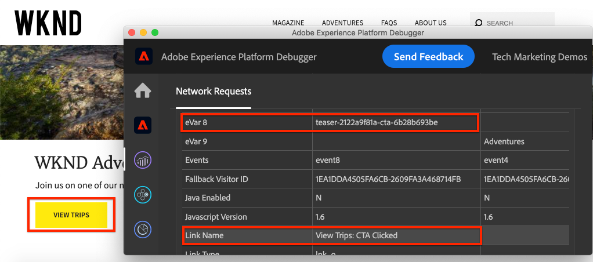
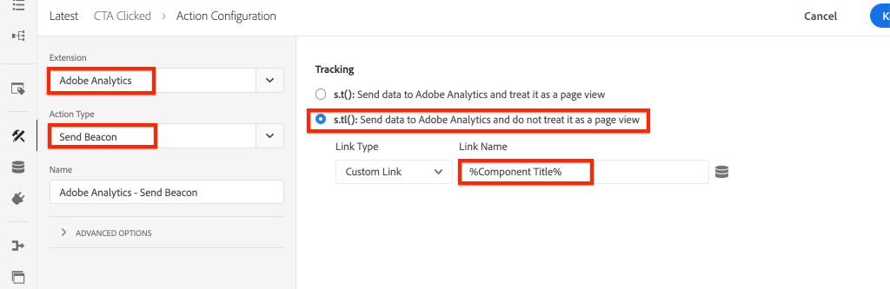

# Spåra klickade komponenter med Adobe Analytics

>[!NOTE]
>
>Adobe Experience Platform Launch har omklassificerats som en serie datainsamlingstekniker i Adobe Experience Platform. Som ett resultat av detta har flera terminologiska förändringar införts i produktdokumentationen. Se följande [dokument](https://experienceleague.adobe.com/docs/experience-platform/tags/term-updates.html) för en konsoliderad hänvisning till terminologiska förändringar.

Använd händelsestyrda [Adobe Client Data Layer med AEM Core Components](https://experienceleague.adobe.com/docs/experience-manager-core-components/using/developing/data-layer/overview.html) för att spåra klick på specifika komponenter på en Adobe Experience Manager-webbplats. Lär dig hur du använder regler i taggegenskapen för att lyssna efter klickhändelser, filtrera efter komponent och skicka data till en Adobe Analytics med en spårlänkssignal.

## Vad du ska bygga {#what-build}

WKND:s marknadsföringsteam är intresserade av att veta vilka `Call to Action (CTA)` -knapparna fungerar bäst på hemsidan. I den här självstudiekursen lägger vi till en regel i taggegenskapen som lyssnar efter `cmp:click` händelser från **Teaser** och **Knapp** -komponenter. Skicka sedan komponent-ID:t och en ny händelse till Adobe Analytics tillsammans med spårlänkens fyr.



### Mål {#objective}

1. Skapa en händelsestyrd regel i taggegenskapen som hämtar `cmp:click` -händelse.
1. Filtrera de olika händelserna efter komponentresurstyp.
1. Ange komponent-id:t och skicka en händelse till Adobe Analytics med spårlänkens fyr.

## Förutsättningar

Den här självstudiekursen är en fortsättning på [Samla in siddata med Adobe Analytics](./collect-data-analytics.md) och förutsätter att du har:

* A **Tagg, egenskap** med [Adobe Analytics-tillägg](https://experienceleague.adobe.com/docs/experience-platform/tags/extensions/client/analytics/overview.html) aktiverad
* **Adobe Analytics** test/dev report suite ID and tracking server. Se följande dokumentation för [skapa en rapportsvit](https://experienceleague.adobe.com/docs/analytics/admin/admin-tools/manage-report-suites/c-new-report-suite/new-report-suite.html).
* [Felsökning för Experience Platform](https://experienceleague.adobe.com/docs/platform-learn/data-collection/debugger/overview.html) webbläsartillägg som har konfigurerats med taggegenskapen inläst på [WKND-webbplats](https://wknd.site/us/en.html) eller en AEM med datalagret Adobe aktiverat.

## Inspect the Button and Teaser schema

Innan du skapar regler i taggegenskapen är det bra att granska [schema för Button och Teaser](https://experienceleague.adobe.com/docs/experience-manager-core-components/using/developing/data-layer/overview.html#item) och inspektera dem i datalagrets implementering.

1. Navigera till [WKND - startsida](https://wknd.site/us/en.html)
1. Öppna webbläsarens utvecklarverktyg och gå till **Konsol**. Kör följande kommando:

   ```js
   adobeDataLayer.getState();
   ```

   Ovanför kod returnerar det aktuella läget för Adobe-klientdatalagret.

   

1. Expandera svaret och hitta poster som har prefixet `button-` och  `teaser-xyz-cta` post. Du bör se ett dataschema som följande:

   Knappschema:

   ```json
   button-2e6d32893a:
       @type: "wknd/components/button"
       dc:title: "View All"
       parentId: "page-2eee4f8914"
       repo:modifyDate: "2020-07-11T22:17:55Z"
       xdm:linkURL: "/content/wknd/us/en/magazine.html"
   ```

   Teaser Schema:

   ```json
   teaser-da32481ec8-cta-adf3c09db9:
       @type: "wknd/components/teaser/cta"
       dc:title: "Surf's Up"
       parentId: "teaser-da32481ec8"
       xdm:linkURL: "/content/wknd/us/en/magazine/san-diego-surf.html"
   ```

   Ovanstående datainformation baseras på [Komponent-/behållarobjektschema](https://experienceleague.adobe.com/docs/experience-manager-core-components/using/developing/data-layer/overview.html#item). Den nya taggregeln använder det här schemat.

## Skapa en CTA-klickad regel

Adobe-klientdatalagret är ett **event** datalager. När någon Core Component klickas på en `cmp:click` -händelsen skickas via datalagret. Lyssna efter `cmp:click` -händelse, låt oss skapa en regel .

1. Navigera till Experience Platform och till taggegenskapen som är integrerad med AEM.
1. Navigera till **Regler** i taggegenskapsgränssnittet och klicka sedan på **Lägg till regel**.
1. Namnge regeln **CTA klickat**.
1. Klicka **Händelser** > **Lägg till** för att öppna **Händelsekonfiguration** guide.
1. För **Händelsetyp** fält, markera **Egen kod**.

   

1. Klicka **Öppna redigeraren** i huvudpanelen och ange följande kodfragment:

   ```js
   var componentClickedHandler = function(evt) {
      // defensive coding to avoid a null pointer exception
      if(evt.hasOwnProperty("eventInfo") && evt.eventInfo.hasOwnProperty("path")) {
         //trigger Tag Rule and pass event
         console.debug("cmp:click event: " + evt.eventInfo.path);
         var event = {
            //include the path of the component that triggered the event
            path: evt.eventInfo.path,
            //get the state of the component that triggered the event
            component: window.adobeDataLayer.getState(evt.eventInfo.path)
         };
   
         //Trigger the Tag Rule, passing in the new `event` object
         // the `event` obj can now be referenced by the reserved name `event` by other Tag Property data elements
         // i.e `event.component['someKey']`
         trigger(event);
      }
   }
   
   //set the namespace to avoid a potential race condition
   window.adobeDataLayer = window.adobeDataLayer || [];
   //push the event listener for cmp:click into the data layer
   window.adobeDataLayer.push(function (dl) {
      //add event listener for `cmp:click` and callback to the `componentClickedHandler` function
      dl.addEventListener("cmp:click", componentClickedHandler);
   });
   ```

   Ovanstående kodfragment lägger till en händelseavlyssnare med [trycka en funktion](https://github.com/adobe/adobe-client-data-layer/wiki#pushing-a-function) till datalagret. När `cmp:click` -händelsen aktiveras `componentClickedHandler` funktionen anropas. I den här funktionen läggs några säkerhetskontroller till och en ny `event` objektet har skapats med den senaste [datalagrets läge](https://github.com/adobe/adobe-client-data-layer/wiki#getstate) för komponenten som utlöste händelsen.

   Äntligen `trigger(event)` funktionen anropas. The `trigger()` funktionen är ett reserverat namn i taggegenskapen och den **utlösare** regeln. The `event` objektet skickas som en parameter som i sin tur visas med ett annat reserverat namn i taggegenskapen. Dataelement i taggegenskapen kan nu referera till olika egenskaper med hjälp av kodfragment som `event.component['someKey']`.

1. Spara ändringarna.
1. Nästa under **Åtgärder** klicka **Lägg till** för att öppna **Åtgärdskonfiguration** guide.
1. För **Åtgärdstyp** fält, välj **Egen kod**.

   

1. Klicka **Öppna redigeraren** i huvudpanelen och ange följande kodfragment:

   ```js
   console.debug("Component Clicked");
   console.debug("Component Path: " + event.path);
   console.debug("Component type: " + event.component['@type']);
   console.debug("Component text: " + event.component['dc:title']);
   ```

   The `event` objektet skickas från `trigger()` metoden anropas i den anpassade händelsen. The `component` objektet är det aktuella läget för komponenten som härleds från datalagret `getState()` och är det element som utlöste klickningen.

1. Spara ändringarna och kör en [bygg](https://experienceleague.adobe.com/docs/experience-platform/tags/publish/builds.html) i tagg-egenskapen för att höja upp koden för [miljö](https://experienceleague.adobe.com/docs/experience-platform/tags/publish/environments/environments.html) som används på din AEM.

   >[!NOTE]
   >
   > Det kan vara användbart att använda [Adobe Experience Platform Debugger](https://experienceleague.adobe.com/docs/platform-learn/data-collection/debugger/overview.html) för att växla inbäddningskoden till en **Utveckling** miljö.

1. Navigera till [WKND-plats](https://wknd.site/us/en.html) och öppna utvecklarverktygen för att visa konsolen. Välj även **Bevara logg** kryssrutan.

1. Klicka på en av **Teaser** eller **Knapp** CTA-knappar för att navigera till en annan sida.

   

1. Observera att utvecklarkonsolen **CTA klickat** regeln har utlösts:

   

## Skapa dataelement

Skapa sedan ett dataelement för att hämta komponent-ID:t och titeln som du klickade på. Återkalla i föregående övning resultatet av `event.path` var något liknande `component.button-b6562c963d` och värdet av `event.component['dc:title']` var som &quot;View Trips&quot;.

### Komponent-ID

1. Navigera till Experience Platform och till taggegenskapen som är integrerad med AEM.
1. Navigera till **Dataelement** och klicka **Lägg till nytt dataelement**.
1. För **Namn** fält, ange **Komponent-ID**.
1. För **Dataelementtyp** fält, markera **Egen kod**.

   

1. Klicka **Öppna redigeraren** och ange följande i den anpassade kodredigeraren:

   ```js
   if(event && event.path && event.path.includes('.')) {
       // split on the `.` to return just the component ID
       return event.path.split('.')[1];
   }
   ```

1. Spara ändringarna.

   >[!NOTE]
   >
   > Kom ihåg att `event` objektet görs tillgängligt och omfång baserat på den händelse som utlöste **Regel** in-taggegenskap. Värdet för ett dataelement anges inte förrän dataelementet är *refererad* inom en regel. Därför är det säkert att använda det här dataelementet i en regel som **Inläst sida** regel som skapades i föregående steg *men* inte är säkert att använda i andra sammanhang.


### Komponenttitel

1. Navigera till **Dataelement** och klicka **Lägg till nytt dataelement**.
1. För **Namn** fält, ange **Komponenttitel**.
1. För **Dataelementtyp** fält, markera **Egen kod**.
1. Klicka **Öppna redigeraren** och ange följande i den anpassade kodredigeraren:

   ```js
   if(event && event.component && event.component.hasOwnProperty('dc:title')) {
       return event.component['dc:title'];
   }
   ```

1. Spara ändringarna.

## Lägga till ett villkor i regeln CTA klickat

Uppdatera sedan **CTA klickat** regel som säkerställer att regeln bara aktiveras när `cmp:click` händelsen utlöses för en **Teaser** eller en **Knapp**. Eftersom Teaser CTA betraktas som ett separat objekt i datalagret är det viktigt att kontrollera det överordnade objektet för att verifiera att det kommer från ett Teaser.

1. I taggegenskapsgränssnittet går du till **CTA klickat** regeln skapades tidigare.
1. Under **Villkor** klicka **Lägg till** för att öppna **Villkorskonfiguration** guide.
1. För **Villkorstyp** fält, markera **Egen kod**.

   

1. Klicka **Öppna redigeraren** och ange följande i den anpassade kodredigeraren:

   ```js
   if(event && event.component && event.component.hasOwnProperty('@type')) {
       // console.log("Event Type: " + event.component['@type']);
       //Check for Button Type OR Teaser CTA type
       if(event.component['@type'] === 'wknd/components/button' ||
          event.component['@type'] === 'wknd/components/teaser/cta') {
           return true;
       }
   }
   
   // none of the conditions are met, return false
   return false;
   ```

   Ovanstående kod kontrollerar först om resurstypen kommer från en **Knapp** eller om resurstypen kommer från en CTA inom en **Teaser**.

1. Spara ändringarna.

## Ange analysvariabler och utlösa Track Link Beacon

För närvarande är **CTA klickat** regeln returnerar bara en konsolsats. Använd sedan dataelementen och Analytics-tillägget för att ange Analytics-variabler som **åtgärd**. Låt oss också ange en extra åtgärd för att aktivera **Spåra länk** och skicka insamlade data till Adobe Analytics.

1. I **CTA klickat** regel, **ta bort** den **Core - anpassad kod** åtgärd (konsolprogramsatser):

   

1. Klicka på under Åtgärder **Lägg till** för att skapa en åtgärd.
1. Ange **Tillägg** skriv till **Adobe Analytics** och ange **Åtgärdstyp** till  **Ange variabler**.

1. Ange följande värden för **eVars**, **Props** och **Händelser**:

   * `evar8` - `%Component ID%`
   * `prop8` - `%Component ID%`
   * `event8`

   

   >[!NOTE]
   >
   > Här `%Component ID%` används eftersom den garanterar en unik identifierare för den CTA som användaren klickar på. En potentiell nackdel med att använda `%Component ID%` är att analysrapporten innehåller värden som `button-2e6d32893a`. Använda `%Component Title%` skulle ge ett mer användarvänligt namn, men värdet kanske inte är unikt.

1. Lägg sedan till en extra åtgärd till höger om **Adobe Analytics - Ange variabler** genom att trycka på **plus** ikon:

   

1. Ange **Tillägg** skriv till **Adobe Analytics** och ange **Åtgärdstyp** till  **Skicka Beacon**.
1. Under **Spårning** ställ in alternativknappen på **`s.tl()`**.
1. För **Länktyp** fält, välj **Egen länk** och for **Länknamn** ange värdet till: **`%Component Title%: CTA Clicked`**:

   

   Konfigurationen ovan kombinerar den dynamiska variabeln från dataelementet **Komponenttitel** och den statiska strängen **CTA klickat**.

1. Spara ändringarna. The **CTA klickat** regeln ska nu ha följande konfiguration:

   

   * **1.** Lyssna på `cmp:click` -händelse.
   * **2.** Kontrollera att händelsen utlöstes av en **Knapp** eller **Teaser**.
   * **3.** Ange analysvariabler för att spåra **Komponent-ID** som **eVar**, **prop** och en **event**.
   * **4.** Skicka Länken Analytics Track (och gör det) **not** behandlas som en sidvy).

1. Spara alla ändringar och bygg ditt taggbibliotek och marknadsför till rätt miljö.

## Validera beteendet för spårlänk och Analytics-anropet

Nu när **CTA klickat** regel skickar analysfyren, så du bör kunna se analysspårningsvariablerna med hjälp av Experience Platform-felsökaren.

1. Öppna [WKND-plats](https://wknd.site/us/en.html) i webbläsaren.
1. Klicka på ikonen Felsökning  för att öppna felsökningsprogrammet för Experience Platform.
1. Kontrollera att felsökaren mappar taggegenskapen till *din* Utvecklingsmiljö, som beskrivits tidigare, och **Konsolloggning** är markerad.
1. Öppna Analytics-menyn och kontrollera att rapportsviten är inställd på *din* rapportsvit.

   

1. Klicka på något av alternativen i webbläsaren **Teaser** eller **Knapp** CTA-knappar för att navigera till en annan sida.

   

1. Återgå till Felsökning för Experience Platform och rulla nedåt och expandera **Nätverksförfrågningar** > *Din rapportsvit*. Du bör kunna hitta **eVar**, **prop** och **event** set.

   

1. Gå tillbaka till webbläsaren och öppna utvecklarkonsolen. Navigera till webbplatsens sidfot och klicka på en av navigeringslänkarna:

   

1. Observera meddelandet i webbläsarkonsolen *&quot;Anpassad kod&quot; för regeln &quot;CTA-klickad&quot; uppfylldes inte*.

   Ovanstående meddelande är att navigeringskomponenten inte utlöser en `cmp:click` event *men* på grund av [Villkor till regeln](#add-a-condition-to-the-cta-clicked-rule) som kontrollerar resurstypen ingen åtgärd utförs.

   >[!NOTE]
   >
   > Om inga konsolloggar visas kontrollerar du att **Konsolloggning** är incheckad **Experience Platform-taggar** i Experience Platform Debugger.

## Grattis!

Du har precis använt det händelsestyrda Adobe-klientdatalagret och -taggen i Experience Platform för att spåra klickningar på specifika komponenter på en AEM plats.
