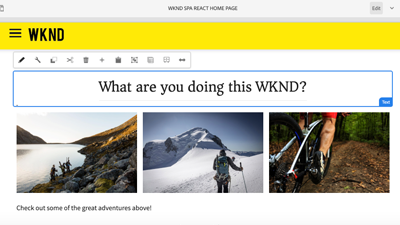

# AEM Sites videor och självstudiekurser {#overview}

{{edge-delivery-services}}

Adobe Experience Manager (AEM) Sites är en ledande plattform för upplevelsehantering. Den här användarhandboken innehåller videor och självstudiekurser om de många funktionerna i AEM Sites.

## Tre sätt att bygga med AEM Sites

AEM Sites erbjuder tre sätt att bygga, skapa och leverera upplevelser. Vare sig du skapar hela sidor, optimerar för att få bättre prestanda eller använder headless-appar kan AEM Sites erbjuda flexibla alternativ som passar dina projektbehov:

1. **Edge Delivery Services**-webbplatser använder dokumentbaserad redigering eller Adobe Universal Editor för att skapa innehåll som sedan aktiveras och sedan skickas till slutanvändarna av Edge Delivery Services som HTML-webbsidor. Det här alternativet gäller främst för _nya och befintliga projekt_ som kräver höga prestanda, skalbarhet och hastighet.
1. Webbupplevelserna **Headless/API-first** använder Content Fragment Editor eller Universal Editor för att skapa innehåll som sedan aktiveras och levereras av AEM Publish som JSON. Det här alternativet gäller främst för _nya och befintliga projekt_ som kräver headlessleverans av innehåll till mobilappar, SPA-program (single page applications) eller andra headless-program.
1. **Traditionell AEM** är inte det senaste sättet att skapa webbupplevelser med AEM Sites. Traditionell AEM använder AEM Authors sidredigerare för att skapa innehåll som sedan aktiveras och skickas till slutanvändare via AEM Publish som HTML-webbsidor. Traditionell AEM rekommenderas för _befintliga projekt_.

Dessa alternativ är utformade för att tillgodose de olika behoven hos marknadsföringsorganisationer, och för att leverera personaliserade, engagerande upplevelser med hög hastighet och skala över alla kanaler och enheter.

>[!IMPORTANT]
>
> **Edge Delivery Services** är det senaste sättet att bygga med AEM Sites. Det är utformat för att leverera högpresterande webbplatser i stor skala och utnyttja kraften i Adobe Edge Network.

I följande diagram visas de olika banorna:

{width="700" zoomable="yes"}

### Jämför olika sätt att bygga med AEM Sites

I följande tabell visas en jämförelse på hög nivå av de tre banorna. Det fokuserar på de olika banornas innehållsutveckling och upplevelseleverans.

|            | Edge Delivery Services | Headless / API-First | Traditionell AEM |
|---------------------|------------------------------|---------------------------------|---------------------------------------------|
| **Bäst för** | Webbplatser med hög trafik, höga prestanda och skalbarhet | Mobilappar, SPA och andra headless-applikationer | Befintliga projekt (inte den senaste metoden) |
| **Redigeringsverktyg** | Dokumentbaserad redigering, Universal Editor | Content Fragments, Universal Editor | Page Editor |
| **Skapat innehållsarkiv** | Dokument eller AEM Author (JCR) | AEM Author (JCR) | AEM Author (JCR) |
| **Leverans** | Edge Delivery Services | AEM Publish (w/ Adobe CDN + Dispatcher) | AEM Publish (w/ Adobe CDN + Dispatcher) |
| **Leveransinnehållsarkiv** | Edge Delivery Services | AEM Publish (JCR) | AEM Publish (JCR) |
| **Leveransformat** | HTML | JSON | HTML |
| **Utvecklingsteknik** | JavaScript, CSS | Valfritt (t.ex. virvel, reaktion) | Java™, JavaScript, CSS |
| **Implementeringsfas** | Nya och befintliga projekt | Nya och befintliga projekt | Endast befintliga projekt |

## Självstudiekurser

Lär dig mer om de tre vägar du kan bygga med AEM Sites med hjälp av följande självstudiekurser:

<!-- CARDS

* https://www.aem.live/docs/
  {title = Edge Delivery Services - Guides}
  {description = Explore Edge Delivery Services with comprehensive guides. The Build, Publish, and Launch guides cover everything you need to get started with EDS.}
  {image = ./assets/edge-delivery-services.png}
  {target = _blank}
* https://experienceleague.adobe.com/sv/docs/experience-manager-learn/getting-started-with-aem-headless/overview
  {title = Headless/API-First - Tutorials}
  {description = Learn how to build headless applications powered by AEM content. Tutorials cover frameworks like iOS, Android, and React—choose what fits your stack.}
  {image = ./assets/headless.png}
  {target = _self}
* https://experienceleague.adobe.com/sv/docs/experience-manager-learn/getting-started-wknd-tutorial-develop/overview
  {title = Traditional AEM - WKND Tutorial}
  {description = Learn how to build a sample AEM Sites project using the WKND tutorial. This guide walks you through project setup, Core Components, Editable Templates, client-side libraries, and component development.}
  {image = ./assets/aem-wknd-spa-editor-tutorial.png}
  {target = _self}
-->
<!-- START CARDS HTML - DO NOT MODIFY BY HAND -->

    

        

            

                <figure class="image x-is-16by9">
                    
                </figure>
            

            

                

                    

                        <a href="https://www.aem.live/docs/" target="_blank" rel="referrer" title="Edge Delivery Services - stödlinjer">Edge Delivery Services - stödlinjer</a>
                    

                    
Utforska Edge Delivery Services med omfattande guider. Handböckerna Build, Publish och Launch täcker allt du behöver för att komma igång med EDS.

                

                <a href="https://www.aem.live/docs/" target="_blank" rel="referrer" class="spectrum-Button spectrum-Button--outline spectrum-Button--primary spectrum-Button--sizeM" style="align-self: flex-start; margin-top: 1rem;">
                    Läs mer
                </a>
            

        

    

    

        

            

                <figure class="image x-is-16by9">
                    
                </figure>
            

            

                

                    

                        <a href="https://experienceleague.adobe.com/sv/docs/experience-manager-learn/getting-started-with-aem-headless/overview" target="_self" rel="referrer" title="Headless/API-First - Tutorials">Headless/API-First - Tutorials</a>
                    

                    
Lär dig hur du skapar headless-applikationer som bygger på AEM-material. Självstudiekurserna omfattar ramverk som iOS, Android och React - välj vad som passar er bäst.

                

                <a href="https://experienceleague.adobe.com/sv/docs/experience-manager-learn/getting-started-with-aem-headless/overview" target="_self" rel="referrer" class="spectrum-Button spectrum-Button--outline spectrum-Button--primary spectrum-Button--sizeM" style="align-self: flex-start; margin-top: 1rem;">
                    Läs mer
                </a>
            

        

    

    

        

            

                <figure class="image x-is-16by9">
                    
                </figure>
            

            

                

                    

                        <a href="https://experienceleague.adobe.com/sv/docs/experience-manager-learn/getting-started-wknd-tutorial-develop/overview" target="_self" rel="referrer" title="Traditionell AEM - WKND självstudiekurs">Traditionell AEM - WKND-självstudiekurs</a>
                    

                    
Lär dig hur du bygger ett AEM Sites-projekt med WKND-självstudiekursen. I den här guiden får du hjälp med projektinställningar, kärnkomponenter, redigerbara mallar, klientbibliotek och komponentutveckling.

                

                <a href="https://experienceleague.adobe.com/sv/docs/experience-manager-learn/getting-started-wknd-tutorial-develop/overview" target="_self" rel="referrer" class="spectrum-Button spectrum-Button--outline spectrum-Button--primary spectrum-Button--sizeM" style="align-self: flex-start; margin-top: 1rem;">
                    Läs mer
                </a>
            

        

    

<!-- END CARDS HTML - DO NOT MODIFY BY HAND -->

## Ytterligare resurser

* [AEM Sites redigeringsdokumentation](https://experienceleague.adobe.com/sv/docs/experience-manager-65/content/sites/authoring/essentials/first-steps)
* [AEM Sites Developing documentation](https://experienceleague.adobe.com/sv/docs/experience-manager-65/content/implementing/developing/introduction/getting-started)
* [AEM Sites Administering-dokumentation](https://experienceleague.adobe.com/sv/docs/experience-manager-65/content/sites/administering/home)
* [AEM Sites distributionsdokumentation](https://experienceleague.adobe.com/sv/docs/experience-manager-65/content/implementing/deploying/introduction/platform)
* [AEM as a Cloud Service självstudiekurser](/help/cloud-service/overview.md)
* [AEM Assets självstudiekurser](/help/assets/overview.md)
* [AEM Forms självstudiekurser](/help/forms/overview.md)
* [AEM Foundation - självstudiekurser](/help/foundation/overview.md)
