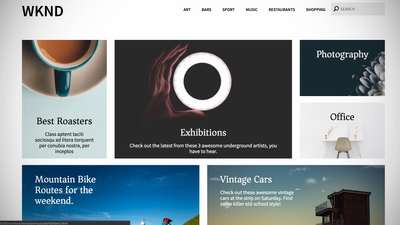

# AEM Sites videor och självstudiekurser {#overview}

{{edge-delivery-services}}

Adobe Experience Manager (AEM) Sites är en ledande plattform för upplevelsehantering. Den här användarhandboken innehåller videor och självstudiekurser om de många funktionerna i AEM Sites.

## Personalval

<table>
<tr>
  <td>
    
    

      <a href="https://experienceleague.adobe.com/docs/experience-manager-learn/getting-started-wknd-tutorial-develop/overview.html">
    <strong>Komma igång med AEM Sites</strong>
    </a>
    

    

    <em>En guide för att komma igång för utvecklare som vill implementera AEM Sites.</em>
    

  </td>
  <td>
    
    

    <a href="https://experienceleague.adobe.com/docs/experience-manager-learn/getting-started-with-aem-headless/overview.html">
    <strong>Komma igång med AEM Headless</strong>
    </a>
    

    

    <em>En guide för att komma igång för utvecklare som vill använda AEM som headless CMS.</em>
    

  </td>
  <td>
    
     

      <a href="https://experienceleague.adobe.com/docs/experience-manager-learn/getting-started-with-aem-headless/spa-editor/react/overview.html">
        <strong>Komma igång med AEM SPA</strong>
      </a>
    

    

    <em>En guide som hjälper utvecklare att integrera ett enda program (SPA) med AEM.</em>
    

  </td>
</tr>
</table>

## Ytterligare resurser

* [AEM Sites Authoring documentation](https://experienceleague.adobe.com/docs/experience-manager-65/authoring/home.html)
* [AEM Sites Developing documentation](https://experienceleague.adobe.com/docs/experience-manager-65/developing/home.html)
* [AEM Sites Administering - dokumentation](https://experienceleague.adobe.com/docs/experience-manager-65/administering/home.html)
* [Dokumentation för AEM Sites Deploying](https://experienceleague.adobe.com/docs/experience-manager-65/deploying/home.html)
* [AEM as a Cloud Service självstudier](/help/cloud-service/overview.md)
* [AEM Assets självstudiekurser](/help/assets/overview.md)
* [AEM Forms självstudiekurser](/help/forms/overview.md)
* [AEM Foundation - självstudiekurser](/help/foundation/overview.md)
