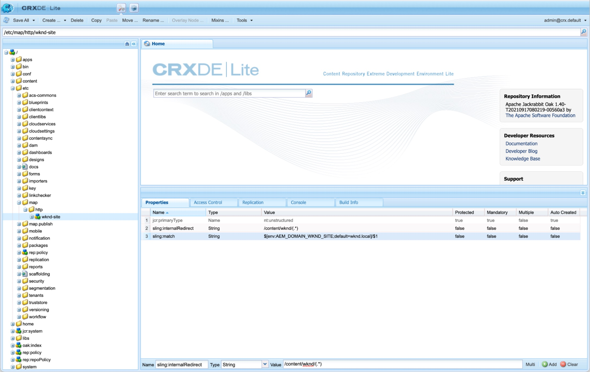

# Webbplatskartor

Lär dig hur du kan förbättra din SEO genom att skapa webbplatskartor för AEM Sites.

>[!WARNING]
>
>I den här videon visas hur relativa URL:er används i platskartan. Webbplatskartor [ska använda absoluta URL:er](https://sitemaps.org/protocol.html). Se [Konfigurationer](#absolute-sitemap-urls) för hur du aktiverar absoluta URL:er, eftersom detta inte beskrivs i videon nedan.

>[!VIDEO](https://video.tv.adobe.com/v/337960?quality=12&learn=on)

## Konfigurationer

### Absoluta URL för webbplatskarta{#absolute-sitemap-urls}

AEM sitemap stöder absoluta URL:er med [Sling-mappning](https://sling.apache.org/documentation/the-sling-engine/mappings-for-resource-resolution.html). Detta gör du genom att skapa mappningsnoder på de AEM tjänsterna som genererar platskartor (vanligtvis AEM Publiceringstjänst).

Exempel på noddefinition för Sling-mappning för `https://wknd.com` kan definieras under `/etc/map/https` enligt följande:

| Bana | Egenskapsnamn | Egenskapstyp | Egenskapsvärde |
|------|----------|---------------|-------|
| `/etc/map/https/wknd-site` | `jcr:primaryType` | Sträng | `nt:unstructured` |
| `/etc/map/https/wknd-site` | `sling:internalRedirect` | Sträng | `/content/wknd/(.*)` |
| `/etc/map/https/wknd-site` | `sling:match` | Sträng | `wknd.com/$1` |

Skärmbilden nedan visar en liknande konfiguration, men för `http://wknd.local` (en lokal värdnamnsmappning körs på `http`).




### OSGi-konfiguration för schemaläggare för platskarta

Definierar [OSGi-fabrikskonfiguration](http://localhost:4502/system/console/configMgr/org.apache.sling.sitemap.impl.SitemapScheduler) för frekvensen (med [cron-uttryck](http://www.cronmaker.com/)) webbplatskartor genereras om/cachelagras i AEM.

`ui.config/src/main/jcr_content/apps/wknd/osgiconfig/config.publish`

```json
{
  "scheduler.name": "WKND Sitemaps",
  "scheduler.expression": "0 0 2 1/1 * ? *",
  "searchPath": "/content/wknd"
}
```

### Filterregel för Tillåt utskickning

Tillåt HTTP-begäranden för platskarteläge och platskartefiler.

`dispatcher/src/conf.dispatcher.d/filters/filters.any`

```
...

# Allow AEM sitemaps
/0200 { /type "allow" /path "/content/*" /selectors '(sitemap-index|sitemap)' /extension "xml" }
```

### Omskrivningsregel för Apache-webbserver

Säkerställ `.xml` HTTP-begäranden för platskarta dirigeras till rätt underliggande AEM. Om URL-förkortning inte används, eller om delningskartor används för att uppnå URL-förkortning, behövs inte den här konfigurationen.

`dispatcher/src/conf.d/rewrites/rewrite.rules`

```
...
RewriteCond %{REQUEST_URI} (.html|.jpe?g|.png|.svg|.xml)$
RewriteRule ^/(.*)$ /content/${CONTENT_FOLDER_NAME}/$1 [PT,L]
```

## Resurser

+ [AEM webbplatskartdokumentation](https://experienceleague.adobe.com/docs/experience-manager-cloud-service/content/overview/seo-and-url-management.html?lang=en)
+ [Dokumentation för Apache Sling Sitemap](https://github.com/apache/sling-org-apache-sling-sitemap#readme)
+ [Sitemap.org för Dreamweaver](https://www.sitemaps.org/protocol.html)
+ [Sitemap.org för indexfiler för platskartor](https://www.sitemaps.org/protocol.html#index)
+ [Cronmaker](http://www.cronmaker.com/)