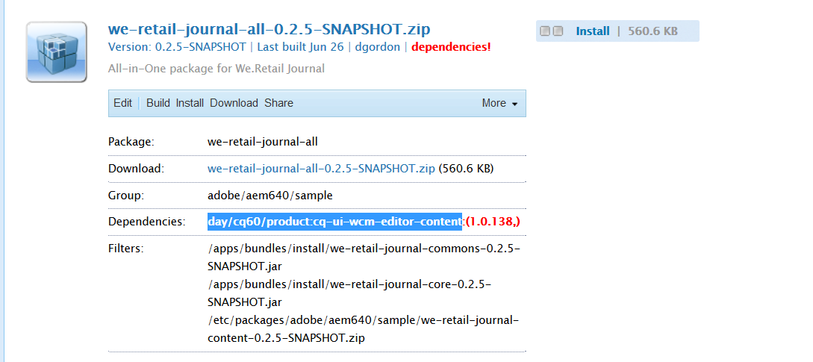

# Developing with the AEM SPA Editor - Hello World Tutorial {#developing-with-the-aem-spa-editor-hello-world-tutorial}

>[!WARNING]
>
> Den här självstudiekursen är **inaktuell**. Vi rekommenderar att du följer något av följande: [Komma igång med AEM SPA-redigerare och vinkelrät](https://docs.adobe.com/content/help/en/experience-manager-learn/spa-angular-tutorial/overview.html) eller [Komma igång med AEM SPA-redigerare och Reagera](https://docs.adobe.com/content/help/en/experience-manager-learn/spa-react-tutorial/overview.html)

AEM SPA Editor har stöd för kontextredigering av ett Single Page-program eller SPA. Den här självstudiekursen är en introduktion till SPA-utveckling som ska användas med AEM SPA Editor JS SDK. I självstudiekursen utökas appen We.Retail Journal genom att en anpassad Hello World-komponent läggs till. Användare kan slutföra självstudiekursen med React- eller Angular-ramverk.

>[!NOTE]
>
> Funktionen SPA-redigerare (Single-Page Application) kräver AEM 6.4 Service Pack 2 eller senare.
>
> SPA-redigeraren är den rekommenderade lösningen för projekt som kräver SPA-ramverksbaserad rendering på klientsidan (t.ex. React eller Angular).

## Nödvändig läsning {#prereq}

Den här självstudiekursen är avsedd att markera de steg som behövs för att mappa en SPA-komponent till en AEM för att aktivera kontextredigering. Användare som börjar med den här självstudiekursen bör känna till grundläggande koncept för utveckling med Adobe Experience Manager, AEM och utveckling med React of Angular-ramverk. Självstudiekursen omfattar både back-end- och front-end-utvecklingsuppgifter.

Du bör granska följande resurser innan du startar den här självstudiekursen:

* [SPA Editor Feature Video](spa-editor-framework-feature-video-use.md) - en videoöversikt av SPA Editor och appen We.Retail Journal.
* [Självstudiekurs](https://reactjs.org/tutorial/tutorial.html) i React.js - en introduktion till hur du utvecklar med React Framework.
* [Vinkelbaserad självstudiekurs](https://angular.io/tutorial) - en introduktion till att utveckla med vinklar

## Lokal utvecklingsmiljö {#local-dev}

Den här självstudiekursen är utformad för:

[Adobe Experience Manager 6.5](https://helpx.adobe.com/experience-manager/6-5/release-notes.html) eller [Adobe Experience Manager 6.4](https://helpx.adobe.com/experience-manager/6-4/sites/deploying/using/technical-requirements.html) + [Service Pack 5](https://helpx.adobe.com/experience-manager/6-4/release-notes/sp-release-notes.html)

I den här självstudiekursen ska följande tekniker och verktyg installeras:

1. [Java 11](https://downloads.experiencecloud.adobe.com/content/software-distribution/en/general.html)
2. [Apache Maven - 3.3.1+](https://maven.apache.org/)
3. [Node.js - 8.11.1+](https://nodejs.org/en/) och npm 5.6.0+ (npm installeras med node.js)

Dubbelkontrollera installationen av ovanstående verktyg genom att öppna en ny terminal och köra följande:

```shell
$ java -version
java version "11 +"

$ mvn -version
Apache Maven 3.3.9

$ node --version
v8.11.1

$ npm --version
6.1.0
```

## Översikt {#overview}

Det grundläggande konceptet är att mappa en SPA-komponent till en AEM. AEM komponenter, som kör server, exporterar innehåll i form av JSON. JSON-innehållet används av SPA, som kör klientsidan i webbläsaren. En 1:1-mappning skapas mellan SPA-komponenter och en AEM.


Populära ramverk [React JS](https://reactjs.org/) och [Angular](https://angular.io/) stöds direkt. Användare kan slutföra den här självstudiekursen i antingen Vinkel eller Reagera, beroende på vilket ramverk de är mest bekväma med.

## Projektinställningar {#project-setup}

Utvecklingen av SPA har en fot AEM utvecklingen och en annan. Målet är att tillåta att SPA-utveckling sker oberoende av varandra och (huvudsakligen) agnostiskt för AEM.

* SPA-projekt kan fungera oberoende av det AEM projektet under utvecklingsfasen.
* Bygg verktyg och tekniker som Webpack, NPM [!DNL Grunt] och [!DNL Gulp]använd sedan vidare.
* För att bygga för AEM kompileras SPA-projektet och inkluderas automatiskt i det AEM projektet.
* AEM som används för att distribuera SPA till AEM.


*Utvecklingen av SPA har en fot AEM utvecklingen, och en annan utåt, vilket gör att SPA-utvecklingen kan ske oberoende av varandra och (huvudsakligen) agnostiskt för AEM.*

Målet med den här självstudiekursen är att utöka appen We.Retail Journal med en ny komponent. Börja med att hämta källkoden för appen We.Retail Journal och distribuera den till en lokal AEM.

1. **Ladda ned** den senaste [journalkoden för Web.Retail från GitHub](https://github.com/adobe/aem-sample-we-retail-journal).

   Eller klona databasen från kommandoraden:

   ```shell
   $ git clone git@github.com:adobe/aem-sample-we-retail-journal.git
   ```

   >[!NOTE]
   >
   >Självstudiekursen fungerar mot den **överordnad** grenen med **1.2.1-SNAPSHOT** -versionen av projektet.

1. Följande struktur ska vara synlig:

   

   Projektet innehåller följande maven-moduler:

   * `all`: Bäddar in och installerar hela projektet i ett enda paket.
   * `bundles`: Innehåller två OSGi-paket: som innehåller [!DNL Sling Models] och annan Java-kod.
   * `ui.apps`: innehåller /apps-delar av projektet, t.ex. JS- och CSS-klientlibs, komponenter, runmode-specifika konfigurationer.
   * `ui.content`: innehåller strukturinnehåll och konfigurationer (`/content`, `/conf`)
   * `react-app`: Reaktionsprogram för webbutiksjournal. Det här är både en Maven-modul och ett webpack-projekt.
   * `angular-app`: Vinkelprogram för detaljhandelsjournal. Detta är både ett [!DNL Maven] modulprojekt och ett webbpaketprojekt.

1. Öppna ett nytt terminalfönster och kör följande kommando för att skapa och distribuera hela programmet till en lokal AEM som körs på [http://localhost:4502](http://localhost:4502).

   ```shell
   $ cd <src>/aem-sample-we-retail-journal
   $ mvn -PautoInstallSinglePackage clean install
   ```

   >[!NOTE]
   >
   > I det här projektet är Maven-profilen att bygga och paketera hela projektet `autoInstallSinglePackage`

   >[!CAUTION]
   >
   > Om du får ett felmeddelande under bygget [kontrollerar du att filen Maven settings.xml innehåller Adobe Maven artifact-databasen](https://helpx.adobe.com/experience-manager/kb/SetUpTheAdobeMavenRepository.html).

1. Navigera till:

   * [http://localhost:4502/editor.html/content/we-retail-journal/react/en/home.html](http://localhost:4502/editor.html/content/we-retail-journal/react/en/home.html)
   * [http://localhost:4502/editor.html/content/we-retail-journal/angular/en/home.html](http://localhost:4502/editor.html/content/we-retail-journal/angular/en/home.html)

   The We.Retail Journal App should be displayed within the AEM Sites editor.

1. I [!UICONTROL Edit] läget markerar du en komponent som du vill redigera och gör en uppdatering av innehållet.

   

1. Klicka på [!UICONTROL Page Properties] ikonen för att öppna [!UICONTROL Page Properties]. Välj [!UICONTROL Edit Template] att öppna sidans mall.

   

1. I den senaste versionen av SPA-redigeraren kan [redigerbara mallar](https://helpx.adobe.com/experience-manager/6-5/sites/developing/using/page-templates-editable.html) användas på samma sätt som med traditionella webbplatsimplementeringar. Detta kommer att granskas senare med vår anpassade komponent.

   >[!NOTE]
   >
   > Endast AEM 6.5 och AEM 6.4 + **Service Pack 5** har stöd för redigerbara mallar.

## Utvecklingsöversikt {#development-overview}


SPA-utvecklingsiterationer inträffar oberoende av AEM. När SPA-programmet är klart att användas AEM följande åtgärder vidtas på hög nivå (se bilden ovan).

1. Det AEM projektet anropas, vilket i sin tur utlöser en bygge av SPA-projektet. The We.Retail Journal använder [**front-maven-plugin**](https://github.com/eirslett/frontend-maven-plugin).
1. SPA-projektets [**aem-clientlib-generator**](https://www.npmjs.com/package/aem-clientlib-generator) bäddar in den kompilerade SPA-filen som ett AEM klientbibliotek i det AEM projektet.
1. Det AEM projektet genererar ett AEM, inklusive den kompilerade SPA-filen, plus annan AEM kod som stöds.

## Skapa AEM {#aem-component}

**Persona: AEM Developer**

En AEM kommer att skapas först. Komponenten AEM ansvarar för att återge de JSON-egenskaper som läses av komponenten React. Komponenten AEM ansvarar också för att tillhandahålla en dialogruta för alla redigerbara egenskaper i komponenten.

Använd [!DNL Eclipse]eller annat [!DNL IDE]för att importera projektet We.Retail Journal Maven.

1. Uppdatera reaktorn **pom.xml** för att ta bort [!DNL Apache Rat] plugin-programmet. Denna plugin kontrollerar varje fil för att se om det finns en licensrubrik. För våra syften behöver vi inte bekymra oss om den här funktionen.

   I **aem-sample-we-retail-journal/pom.xml** remove **apache-rate-plugin**:

   ```xml
   <!-- Remove apache-rat-plugin -->
   <plugin>
           <groupId>org.apache.rat</groupId>
           <artifactId>apache-rat-plugin</artifactId>
           <configuration>
               <excludes combine.children="append">
                   <exclude>*</exclude>
                       ...
               </excludes>
           </configuration>
           <executions>
                   <execution>
                       <phase>verify</phase>
                       <goals>
                           <goal>check</goal>
                       </goals>
               </execution>
           </executions>
       </plugin>
   ```

1. I modulen **we-retail-journal-content** (`<src>/aem-sample-we-retail-journal/ui.apps`) skapar du en ny nod under `ui.apps/jcr_root/apps/we-retail-journal/components` namnet **heloworld** av typen **cq:Component**.
1. Lägg till följande egenskaper i **huvudkomponenten** , som finns i XML (`/helloworld/.content.xml`) nedan:

   ```xml
   <?xml version="1.0" encoding="UTF-8"?>
   <jcr:root xmlns:cq="http://www.day.com/jcr/cq/1.0" xmlns:jcr="http://www.jcp.org/jcr/1.0"
       jcr:description="Hello World Component for We.Retail Journal"
       jcr:primaryType="cq:Component"
       jcr:title="Hello World"
       componentGroup="We.Retail Journal" />
   ```

   

   >[!NOTE]
   >
   > För att illustrera funktionen Redigerbara mallar har vi angett `componentGroup="Custom Components"`ritytorna exakt. I ett verkligt projekt är det bäst att minimera antalet komponentgrupper, så en bättre grupp är&quot;[!DNL We.Retail Journal]&quot; för att matcha övriga innehållskomponenter.
   >
   > Endast AEM 6.5 och AEM 6.4 + **Service Pack 5** har stöd för redigerbara mallar.

1. Därefter skapas en dialogruta där ett anpassat meddelande kan konfigureras för **Hello World** -komponenten. Under `/apps/we-retail-journal/components/helloworld` lägger du till ett nodnamn **cq:dialog** för **nt:undefined**.
1. Cq:dialog **** visar ett textfält som består av text till egenskapen **[!DNL message]**. Under den nyligen skapade **cq:dialog** lägger du till följande noder och egenskaper, som finns i XML nedan (`helloworld/_cq_dialog/.content.xml`):

   ```xml
   <?xml version="1.0" encoding="UTF-8"?>
   <jcr:root xmlns:sling="http://sling.apache.org/jcr/sling/1.0" xmlns:cq="http://www.day.com/jcr/cq/1.0" xmlns:jcr="http://www.jcp.org/jcr/1.0" xmlns:nt="http://www.jcp.org/jcr/nt/1.0"
       jcr:primaryType="nt:unstructured"
       jcr:title="We.Retail Journal - Hello World"
       sling:resourceType="cq/gui/components/authoring/dialog">
       <content
           jcr:primaryType="nt:unstructured"
           sling:resourceType="granite/ui/components/coral/foundation/container">
           <items jcr:primaryType="nt:unstructured">
               <tabs
                   jcr:primaryType="nt:unstructured"
                   sling:resourceType="granite/ui/components/coral/foundation/tabs"
                   maximized="{Boolean}true">
                   <items jcr:primaryType="nt:unstructured">
                       <properties
                           jcr:primaryType="nt:unstructured"
                           jcr:title="Properties"
                           sling:resourceType="granite/ui/components/coral/foundation/container"
                           margin="{Boolean}true">
                           <items jcr:primaryType="nt:unstructured">
                               <columns
                                   jcr:primaryType="nt:unstructured"
                                   sling:resourceType="granite/ui/components/coral/foundation/fixedcolumns"
                                   margin="{Boolean}true">
                                   <items jcr:primaryType="nt:unstructured">
                                       <column
                                           jcr:primaryType="nt:unstructured"
                                           sling:resourceType="granite/ui/components/coral/foundation/container">
                                           <items jcr:primaryType="nt:unstructured">
                                               <message
                                                   jcr:primaryType="nt:unstructured"
                                                   sling:resourceType="granite/ui/components/coral/foundation/form/textfield"
                                                   fieldLabel="Message"
                                                   name="./message"
                                                   required="{Boolean}true"/>
                                           </items>
                                       </column>
                                   </items>
                               </columns>
                           </items>
                       </properties>
                   </items>
               </tabs>
           </items>
       </content>
   </jcr:root>
   ```

   

   Ovanstående XML-noddefinition skapar en dialogruta med ett textfält där användaren kan skriva ett &quot;meddelande&quot;. Observera egenskapen `name="./message"` i `<message />` noden. Detta är namnet på den egenskap som ska lagras i den JCR som finns i AEM.

1. Därefter skapas en tom principdialogruta (`cq:design_dialog`). Dialogrutan Regler behövs för att visa komponenten i mallredigeraren. I det här enkla fallet är det en tom dialogruta.

   Under `/apps/we-retail-journal/components/helloworld` lägger du till nodnamnet `cq:design_dialog` för `nt:unstructured`.

   Konfigurationen visas i XML nedan (`helloworld/_cq_design_dialog/.content.xml`)

   ```xml
   <?xml version="1.0" encoding="UTF-8"?>
   <jcr:root xmlns:sling="http://sling.apache.org/jcr/sling/1.0" xmlns:cq="http://www.day.com/jcr/cq/1.0" xmlns:jcr="http://www.jcp.org/jcr/1.0" xmlns:nt="http://www.jcp.org/jcr/nt/1.0"
   jcr:primaryType="nt:unstructured" />
   ```

1. Distribuera kodbasen till AEM från kommandoraden:

   ```shell
   $ cd <src>/aem-sample-we-retail-journal/content
   $ mvn -PautoInstallPackage clean install
   ```

   Validera komponenten i [CRXDE Lite](http://localhost:4502/crx/de/index.jsp#/apps/we-retail-journal/global/components/helloworld) genom att granska mappen under `/apps/we-retail-journal/components:`

   

## Skapa segmentmodell {#create-sling-model}

**Persona: AEM Developer**

Därefter [!DNL Sling Model] skapas en underordnad [!DNL Hello World] komponent. I ett traditionellt WCM-fall implementerar [!DNL Sling Model] programmet all affärslogik och ett återgivningsskript på serversidan (HTL) anropar [!DNL Sling Model]. Detta gör återgivningsskriptet relativt enkelt.

[!DNL Sling Models] används också i SPA-användningsexemplet för att implementera affärslogik på serversidan. Skillnaden är att i [!DNL SPA] användningsfallet [!DNL Sling Models] exponerar den dess metoder som serialiserad JSON.

>[!NOTE]
>
>Som en god praxis bör utvecklare titta efter [AEM kärnkomponenter](https://docs.adobe.com/content/help/en/experience-manager-core-components/using/introduction.html) när det är möjligt. Bland annat innehåller Core Components JSON-utdata [!DNL Sling Models] som är&quot;SPA-klara&quot;, vilket gör att utvecklare kan fokusera mer på själva presentationen.

1. Öppna **vårt projekt för webbutiksjournal-commons** ( `<src>/aem-sample-we-retail-journal/bundles/commons`) i valfri redigerare.
1. I paketet `com.adobe.cq.sample.spa.commons.impl.models`:
   * Skapa en ny klass med namnet `HelloWorld`.
   * Lägg till ett implementeringsgränssnitt för `com.adobe.cq.export.json.ComponentExporter.`

   

   Gränssnittet måste implementeras för att `ComponentExporter` det ska vara [!DNL Sling Model] kompatibelt med AEM Content Services.

   ```java
    package com.adobe.cq.sample.spa.commons.impl.models;
   
    import com.adobe.cq.export.json.ComponentExporter;
   
    public class HelloWorld implements ComponentExporter {
   
        @Override
        public String getExportedType() {
            return null;
        }
    }
   ```

1. Lägg till en statisk variabel med namnet `RESOURCE_TYPE` för att identifiera [!DNL HelloWorld] komponentens resurstyp:

   ```java
    ...
    public class HelloWorld implements ComponentExporter {
   
        static final String RESOURCE_TYPE = "we-retail-journal/components/helloworld";
   
        ...
    }
   ```

1. Lägg till OSGi-anteckningarna för `@Model` och `@Exporter`. Anteckningen registrerar `@Model` klassen som en [!DNL Sling Model]. Anteckningen `@Exporter` visar metoderna som serialiserade JSON med hjälp av [!DNL Jackson Exporter] ramverket.

   ```java
   import org.apache.sling.api.SlingHttpServletRequest;
   import org.apache.sling.models.annotations.Exporter;
   import org.apache.sling.models.annotations.Model;
   import com.adobe.cq.export.json.ExporterConstants;
   ...
   
   @Model(
           adaptables = SlingHttpServletRequest.class,
           adapters = {ComponentExporter.class},
           resourceType = HelloWorld.RESOURCE_TYPE
   )
   @Exporter(
           name = ExporterConstants.SLING_MODEL_EXPORTER_NAME, 
           extensions = ExporterConstants.SLING_MODEL_EXTENSION
   )
   public class HelloWorld implements ComponentExporter {
   
   ...
   ```

1. Implementera metoden `getDisplayMessage()` för att returnera JCR-egenskapen `message`. Använd anteckningen i för [!DNL Sling Model] att göra det enkelt att hämta den egenskap `@ValueMapValue` `message` som lagras under komponenten. Anteckningen är viktig eftersom `@Optional` den inte fylls i när komponenten läggs till på sidan första gången `message` .

   Som en del av affärslogiken läggs strängen &quot;**Hello**&quot; till i meddelandet.

   ```java
   import org.apache.sling.models.annotations.injectorspecific.ValueMapValue;
   import org.apache.sling.models.annotations.Optional;
   
   ...
   
   public class HelloWorld implements ComponentExporter {
   
      static final String RESOURCE_TYPE = "we-retail-journal/components/helloworld";
   
      private static final String PREPEND_MSG = "Hello";
   
       @ValueMapValue @Optional
       private String message;
   
       public String getDisplayMessage() {
           if(message != null && message.length() > 0) {
               return PREPEND_MSG + " "  + message;
           }
           return null;
       }
   
   ...
   ```

   >[!NOTE]
   >
   > Metodnamnet `getDisplayMessage` är viktigt. När [!DNL Sling Model] serialiseras med [!DNL Jackson Exporter] den visas den som en JSON-egenskap: `displayMessage`. Metoderna [!DNL Jackson Exporter] serialiseras och visas `getter` som inte tar någon parameter (om de inte uttryckligen markerats för att ignoreras). Senare i appen React/Angular läser vi egenskapsvärdet och visar det som en del av programmet.

   Metoden `getExportedType` är också viktig. Komponentens värde `resourceType` används för att &quot;mappa&quot; JSON-data till den främre komponenten (Vinkel/Reaktion). Vi kommer att undersöka detta i nästa avsnitt.

1. Implementera metoden `getExportedType()` för att returnera resurstypen för `HelloWorld` komponenten.

   ```java
    @Override
       public String getExportedType() {
           return RESOURCE_TYPE;
       }
   ```

   Den fullständiga koden för [**HelloWorld.java** finns här.](https://github.com/Adobe-Marketing-Cloud/aem-guides/blob/master/spa-helloworld-guide/src/bundles/commons/HelloWorld.java)

1. Distribuera koden till AEM med Apache Maven:

   ```shell
   $ cd <src>/sample-we-retail-spa-content/bundles/commons
   $ mvn -PautoInstallPackage clean install
   ```

   Verifiera driftsättningen och registreringen av [!DNL Sling Model] genom att gå till [[!UICONTROL Status] > [!UICONTROL Sling Models]](http://localhost:4502/system/console/status-slingmodels) i OSGi-konsolen.

   Du bör se att `HelloWorld` Sling-modellen är bunden till resurstypen `we-retail-journal/components/helloworld` Sling och att den är registrerad som en [!DNL Sling Model Exporter Servlet]:

   ```shell
   com.adobe.cq.sample.spa.commons.impl.models.HelloWorld - we-retail-journal/components/helloworld
   com.adobe.cq.sample.spa.commons.impl.models.HelloWorld exports 'we-retail-journal/components/helloworld' with selector 'model' and extension '[Ljava.lang.String;@6480f3e5' with exporter 'jackson'
   ```

## Skapa reaktionskomponent {#react-component}

**Persona: Front End Developer**

Därefter skapas komponenten React. Öppna **responsappmodulen** ( `<src>/aem-sample-we-retail-journal/react-app`) med valfri redigerare.

>[!NOTE]
>
> Du kan hoppa över det här avsnittet om du bara är intresserad av [vinkelutveckling](#angular-component).

1. I mappen navigerar du till dess src-mapp `react-app` . Expandera komponentmappen för att visa de befintliga React-komponentfilerna.

   

1. Lägg till en ny fil under komponentmappen med namnet `HelloWorld.js`.
1. Öppna `HelloWorld.js`. Lägg till en import-sats för att importera React-komponentbiblioteket. Lägg till en andra import-sats för att importera hjälpen som `MapTo` tillhandahålls av Adobe. Hjälpprogrammet `MapTo` mappar React-komponenten till den AEM komponentens JSON.

   ```js
   import React, {Component} from 'react';
   import {MapTo} from '@adobe/cq-react-editable-components';
   ```

1. Under importen skapas en ny klass med namnet `HelloWorld` som utökar `Component` gränssnittet Reagera. Lägg till den obligatoriska `render()` metoden i `HelloWorld` klassen.

   ```js
   import React, {Component} from 'react';
   import {MapTo} from '@adobe/cq-react-editable-components';
   
   class HelloWorld extends Component {
   
       render() {
   
       }
   }
   ```

1. Hjälpprogrammet inkluderar automatiskt ett objekt `MapTo` `cqModel` som namnges som en del av React-komponentens props. Den `cqModel` innehåller alla egenskaper som exponeras av [!DNL Sling Model].

   Kom ihåg att den [!DNL Sling Model] som skapades tidigare innehåller en metod `getDisplayMessage()`. `getDisplayMessage()` översätts som en JSON-nyckel med namnet `displayMessage` vid utskrift.

   Implementera metoden för att `render()` skapa en `h1` -tagg som innehåller värdet för `displayMessage`. [JSX](https://reactjs.org/docs/introducing-jsx.html), som är ett syntaxtillägg till JavaScript, används för att returnera den slutliga koden för komponenten.

   ```js
   ...
   
   class HelloWorld extends Component {
       render() {
   
           if(this.props.displayMessage) {
               return (
                   <div className="cmp-helloworld">
                       <h1 className="cmp-helloworld_message">{this.props.displayMessage}</h1>
                   </div>
               );
           }
           return null;
       }
   }
   ```

1. Implementera en redigeringskonfigurationsmetod. Den här metoden skickas via `MapTo` hjälpfunktionen och AEM redigeraren får information om att visa en platshållare om komponenten är tom. Detta inträffar när komponenten läggs till i SPA men ännu inte har skapats. Lägg till följande under `HelloWorld` klassen:

   ```js
   ...
   
   class HelloWorld extends Component {
       ...
   }
   
   const HelloWorldEditConfig = {
   
       emptyLabel: 'Hello World',
   
       isEmpty: function(props) {
           return !props || !props.displayMessage || props.displayMessage.trim().length < 1;
       }
   };
   
   ...
   ```

1. I slutet av filen anropar du `MapTo` hjälparen och skickar `HelloWorld` klassen och `HelloWorldEditConfig`. Detta mappar React-komponenten till AEM utifrån AEM-komponentens resurstyp: `we-retail-journal/components/helloworld`.

   ```js
   MapTo('we-retail-journal/components/helloworld')(HelloWorld, HelloWorldEditConfig);
   ```

   Den färdiga koden för [**HelloWorld.js** finns här.](https://github.com/Adobe-Marketing-Cloud/aem-guides/blob/master/spa-helloworld-guide/src/react-app/components/HelloWorld.js)

1. Open the file `ImportComponents.js`. Den finns på `<src>/aem-sample-we-retail-journal/react-app/src/ImportComponents.js`.

   Lägg till en linje som kräver `HelloWorld.js` med de andra komponenterna i det kompilerade JavaScript-paketet:

   ```js
   ...
     require('./components/Text');
     require('./components/Image');
     require('./components/HelloWorld');
   ...
   ```

1. I `components` mappen skapar du en ny fil med namnet `HelloWorld.css` som en jämställd fil med `HelloWorld.js.` Fyll filen med följande för att skapa en grundläggande formatering för `HelloWorld` komponenten:

   ```css
   /* HelloWorld.css to style HelloWorld component */
   
   .cmp-helloworld_message {
       text-align: center;
       color: #ff505e;
       text-transform: unset;
       letter-spacing: unset;
   }
   ```

1. Öppna `HelloWorld.js` och uppdatera under importprogramsatserna för att kräva `HelloWorld.css`:

   ```js
   import React, {Component} from 'react';
   import {MapTo} from '@adobe/cq-react-editable-components';
   
   require('./HelloWorld.css');
   
   ...
   ```

1. Distribuera koden till AEM med Apache Maven:

   ```shell
   $ cd <src>/sample-we-retail-spa-content
   $ mvn -PautoInstallSinglePackage clean install
   ```

1. Öppna i [CRXDE-Lite](http://localhost:4502/crx/de/index.jsp#/apps/we-retail-journal/react/clientlibs/we-retail-journal-react/js/app.js) `/apps/we-retail-journal/react/clientlibs/we-retail-journal-react/js/app.js`. Utför en snabbsökning efter HelloWorld i app.js för att kontrollera att React-komponenten ingår i den kompilerade appen.

   >[!NOTE]
   >
   > **app.js** är den paketerade React-appen. Koden är inte längre läsbar för människor. Kommandot `npm run build` har utlöst en optimerad version som genererar kompilerat JavaScript som kan tolkas av moderna webbläsare.


## Skapa vinkelkomponent {#angular-component}

**Persona: Front End Developer**

>[!NOTE]
>
> Du kan hoppa över det här avsnittet om du bara är intresserad av React-utveckling.

Därefter skapas vinkelkomponenten. Öppna modulen **vinkelprogram** (`<src>/aem-sample-we-retail-journal/angular-app`) med valfri redigerare.

1. I mappen navigerar du `angular-app` till dess `src` mapp. Expandera komponentmappen för att visa de befintliga komponentfilerna för vinkeln.

   

1. Lägg till en ny mapp under komponentmappen med namnet `helloworld`. Under `helloworld` mappen lägger du till nya filer med namnet `helloworld.component.css, helloworld.component.html, helloworld.component.ts`.

   ```plain
   /angular-app
       /src
           /app
               /components
   +                /helloworld
   +                    helloworld.component.css
   +                    helloworld.component.html
   +                    helloworld.component.ts
   ```

1. Öppna `helloworld.component.ts`. Lägg till en import-sats för att importera vinkelklasserna `Component` och `Input` klasserna. Skapa en ny komponent som pekar på `styleUrls` och `templateUrl` på `helloworld.component.css` och `helloworld.component.html`. Exportera slutligen klassen `HelloWorldComponent` med förväntad inmatning av `displayMessage`.

   ```js
   //helloworld.component.ts
   
   import { Component, Input } from '@angular/core';
   
   @Component({
     selector: 'app-helloworld',
     host: { 'class': 'cmp-helloworld' },
     styleUrls:['./helloworld.component.css'],
     templateUrl: './helloworld.component.html',
   })
   
   export class HelloWorldComponent {
     @Input() displayMessage: string;
   }
   ```

   >[!NOTE]
   >
   > Om du kommer ihåg det [!DNL Sling Model] som skapades tidigare fanns det en metod för **getDisplayMessage()**. Den serialiserade JSON-koden för den här metoden blir **displayMessage**, som vi nu läser i vinkelappen.

1. Öppna `helloworld.component.html` om du vill inkludera en `h1` tagg som ska skriva ut `displayMessage` egenskapen:

   ```html
   <h1 *ngIf="displayMessage" class="cmp-helloworld_message">
       {{displayMessage}}
   </h1>
   ```

1. Uppdatera `helloworld.component.css` så att den innehåller vissa grundläggande format för komponenten.

   ```css
   :host-context {
       display: block;
   };
   
   .cmp-helloworld {
       display:block;
   }
   .cmp-helloworld_message {
       text-align: center;
       color: #ff505e;
       text-transform: unset;
       letter-spacing: unset;
   }
   ```

1. Uppdatera `helloworld.component.spec.ts` med följande testbädd:

   ```js
   import { async, ComponentFixture, TestBed } from '@angular/core/testing';
   
   import { HelloWorldComponent } from './helloworld.component';
   
       describe('HelloWorld', () => {
       let component: HelloWorldComponent;
       let fixture: ComponentFixture<HelloWorldComponent>;
   
       beforeEach(async(() => {
           TestBed.configureTestingModule({
           declarations: [ HelloWorldComponent ]
           })
           .compileComponents();
       }));
   
       beforeEach(() => {
           fixture = TestBed.createComponent(HelloWorldComponent);
           component = fixture.componentInstance;
           fixture.detectChanges();
       });
   
       it('should create', () => {
           expect(component).toBeTruthy();
       });
   });
   ```

1. Nästa uppdatering `src/components/mapping.ts` som innehåller `HelloWorldComponent`. Lägg till en `HelloWorldEditConfig` platshållare i AEM redigerare innan komponenten har konfigurerats. Lägg slutligen till en linje för att mappa AEM till vinkelkomponenten med `MapTo` hjälpen.

   ```js
   // src/components/mapping.ts
   
   import { HelloWorldComponent } from "./helloworld/helloworld.component";
   
   ...
   
   const HelloWorldEditConfig = {
   
       emptyLabel: 'Hello World',
   
       isEmpty: function(props) {
           return !props || !props.displayMessage || props.displayMessage.trim().length < 1;
       }
   };
   
   ...
   
   MapTo('we-retail-journal/components/helloworld')(HelloWorldComponent, HelloWorldEditConfig);
   ```

   Den fullständiga koden för [**mapping.ts** finns här.](https://github.com/Adobe-Marketing-Cloud/aem-guides/blob/master/spa-helloworld-guide/src/angular-app/mapping.ts)

1. Uppdatera `src/app.module.ts` för att uppdatera **NgModule**. Lägg till **`HelloWorldComponent`** som en **deklaration** som tillhör **AppModule**. Lägg också till `HelloWorldComponent` som en **entryComponent** så att den kompileras och inkluderas dynamiskt i programmet när JSON-modellen bearbetas.

   ```js
   import { HelloWorldComponent } from './components/helloworld/helloworld.component';
   
   ...
   
   @NgModule({
     imports: [BrowserModule.withServerTransition({ appId: 'we-retail-sample-angular' }),
       SpaAngularEditableComponentsModule,
     AngularWeatherWidgetModule.forRoot({
       key: "37375c33ca925949d7ba331e52da661a",
       name: WeatherApiName.OPEN_WEATHER_MAP,
       baseUrl: 'http://api.openweathermap.org/data/2.5'
     }),
       AppRoutingModule,
       BrowserTransferStateModule],
     providers: [ModelManagerService,
       { provide: APP_BASE_HREF, useValue: '/' }],
     declarations: [AppComponent,
       TextComponent,
       ImageComponent,
       WeatherComponent,
       NavigationComponent,
       MenuComponent,
       MainContentComponent,
       HelloWorldComponent],
     entryComponents: [TextComponent,
       ImageComponent,
       WeatherComponent,
       NavigationComponent,
       MainContentComponent,
       HelloWorldComponent],
     bootstrap: [AppComponent]
    })
   ```

   Den färdiga koden för [**app.module.ts** finns här.](https://github.com/Adobe-Marketing-Cloud/aem-guides/blob/master/spa-helloworld-guide/src/angular-app/app.module.ts)

1. Distribuera koden till AEM med Maven:

   ```shell
   $ cd <src>/sample-we-retail-spa-content
   $ mvn -PautoInstallSinglePackage clean install
   ```

1. Öppna i [CRXDE-Lite](http://localhost:4502/crx/de/index.jsp#/apps/we-retail-journal/angular/clientlibs/we-retail-journal-angular/js/main.js) `/apps/we-retail-journal/angular/clientlibs/we-retail-journal-angular/js/main.js`. Gör en snabbsökning för **HelloWorld** i `main.js` för att kontrollera att vinkelkomponenten har inkluderats.

   >[!NOTE]
   >
   > **main.js** är den paketerade vinkelappen. Koden är inte längre läsbar för människor. Kommandot npm run build har utlöst en optimerad build som genererar kompilerat JavaScript som kan tolkas av moderna webbläsare.

## Uppdatera mallen {#template-update}

1. Navigera till den redigerbara mallen för React- och/eller Angular-versionerna:

   * (Vinkel) [http://localhost:4502/editor.html/conf/we-retail-journal/angular/settings/wcm/templates/we-retail-angular-weather-template/structure.html](http://localhost:4502/editor.html/conf/we-retail-journal/angular/settings/wcm/templates/we-retail-angular-weather-template/structure.html)
   * (Reagera) [http://localhost:4502/editor.html/conf/we-retail-journal/react/settings/wcm/templates/we-retail-react-weather-template/structure.html](http://localhost:4502/editor.html/conf/we-retail-journal/react/settings/wcm/templates/we-retail-react-weather-template/structure.html)

1. Markera huvudfilen [!UICONTROL Layout Container] och välj [!UICONTROL Policy] -ikonen för att öppna profilen:

   

   Gör en sökning under **[!UICONTROL Properties]** > **[!UICONTROL Allowed Components]**. **[!DNL Custom Components]**. Du bör se **[!DNL Hello World]** komponenten och markera den. Spara ändringarna genom att klicka i kryssrutan i det övre högra hörnet.

   

1. När du har sparat bör du se **[!DNL HelloWorld]** komponenten som en tillåten komponent i [!UICONTROL Layout Container].

   

   >[!NOTE]
   >
   > Endast AEM 6.5 och AEM 6.4.5 har stöd för funktionen Redigerbar mall i SPA-redigeraren. Om du använder AEM 6.4 måste du konfigurera principen för tillåtna komponenter manuellt via CRXDE Lite: `/conf/we-retail-journal/react/settings/wcm/policies/wcm/foundation/components/responsivegrid/default` eller `/conf/we-retail-journal/angular/settings/wcm/policies/wcm/foundation/components/responsivegrid/default`

   CRXDE Lite visar de uppdaterade principkonfigurationerna för [!UICONTROL Allowed Components] i [!UICONTROL Layout Container]:

   

## Sammanställ allt {#putting-together}

1. Navigera till sidorna Vinkel eller Reagera:

   * [http://localhost:4502/editor.html/content/we-retail-journal/react/en/home.html](http://localhost:4502/editor.html/content/we-retail-journal/react/en/home.html)
   * [http://localhost:4502/editor.html/content/we-retail-journal/angular/en/home.html](http://localhost:4502/editor.html/content/we-retail-journal/angular/en/home.html)

1. Hitta **[!DNL Hello World]** komponenten och dra och släpp **[!DNL Hello World]** komponenten på sidan.

   

   Platshållaren ska visas.

   

1. Markera komponenten och lägg till ett meddelande i dialogrutan, t.ex. &quot;World&quot; eller &quot;Your Name&quot;. Spara ändringarna.

   

   Observera att strängen &quot;Hello&quot; alltid föregås av meddelandet. Detta är ett resultat av logiken i `HelloWorld.java`[!DNL Sling Model].

## Nästa steg {#next-steps}

[Slutförd lösning för komponenten HelloWorld](assets/spa-editor-helloworld-tutorial-use/aem-sample-we-retail-journal-HelloWorldSolution.zip)

* Fullständig källkod för [[!DNL We.Retail Journal] GitHub](https://github.com/adobe/aem-sample-we-retail-journal)
* Se en mer ingående självstudiekurs om hur du utvecklar React med [[!DNL Getting Started with the AEM SPA Editor - WKND Tutorial]](https://helpx.adobe.com/experience-manager/kt/sites/using/getting-started-spa-wknd-tutorial-develop.html)

## Felsökning {#troubleshooting}

### Det gick inte att skapa projektet i Eclipse {#unable-to-build-project-in-eclipse}

**Fel:** Ett fel uppstod vid import av [!DNL We.Retail Journal] projektet till Eclipse för okända målkörningar:

`Execution npm install, Execution npm run build, Execution default-analyze-classes*`


**Upplösning**: Klicka på Slutför för att lösa de här senare. Detta bör inte hindra att självstudiekursen slutförs.

**Fel**: Reaktionsmodulen `react-app`fungerar inte som den ska under en Maven-byggnad.

**Upplösning:** Försök att ta bort `node_modules` mappen under **responsappen**. Kör kommandot Apache Maven igen `mvn  clean install -PautoInstallSinglePackage` från projektets rot.

### Otillfredsställda beroenden i AEM {#unsatisfied-dependencies-in-aem}



Om ett AEM inte uppfylls, antingen i **[!UICONTROL AEM Package Manager]** eller i **[!UICONTROL AEM Web Console]** (Felix Console), indikerar detta att SPA-redigeringsfunktionen inte är tillgänglig.

### Komponenten visas inte

**Fel**: Även efter en lyckad distribution och verifiering av att de kompilerade versionerna av React/Angular-programmen har den uppdaterade `helloworld` komponenten visas inte min komponent när jag drar den till sidan. Jag kan se komponenten i AEM.

**Upplösning**: Rensa webbläsarens historik/cacheminne och/eller öppna en ny webbläsare eller använd läget Incognito. Om det inte fungerar gör du klientbibliotekscachen ogiltig på den lokala AEM. AEM försöker cache-lagra stora klientbibliotek för att vara effektiva. Ibland behövs det att manuellt göra cachen ogiltig för att åtgärda problem där inaktuell kod cachelagras.

Navigera till: [http://localhost:4502/libs/granite/ui/content/dumplibs.rebuild.html](http://localhost:4502/libs/granite/ui/content/dumplibs.rebuild.html) och klicka på Invalidera cache. Återgå till sidan Reaktion/Vinkel och uppdatera sidan.


