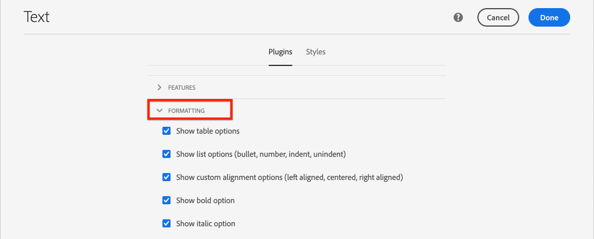

# Mappa SPA-komponenter till AEM {#map-components}

Lär dig hur du mappar vinkelkomponenter till Adobe Experience Manager-komponenter (AEM) med AEM SPA Editor JS SDK. Med komponentmappning kan användare göra dynamiska uppdateringar av SPA-komponenter i AEM SPA-redigeraren, på samma sätt som vid traditionell AEM.

Det här kapitlet innehåller en djupdykning i AEM JSON-modell-API:t och hur JSON-innehåll som exponeras av en AEM automatiskt kan injiceras i en vinkelkomponent som props.

## Syfte

1. Lär dig hur du mappar AEM komponenter till SPA-komponenter.
2. Förstå skillnaden mellan **Container** -komponenter och **Content** -komponenter.
3. Skapa en ny vinkelkomponent som mappar till en befintlig AEM.

## Vad du ska bygga

I det här kapitlet granskas hur den angivna `Text` SPA-komponenten mappas till den AEM `Text`komponenten. En ny `Image` SPA-komponent skapas som kan användas i SPA och skrivas i AEM. Funktionerna i **Layoutbehållaren** och **Mallredigeraren** används också för att skapa en vy som är lite mer varierad.


## Förutsättningar

Granska de verktyg och instruktioner som krävs för att konfigurera en [lokal utvecklingsmiljö](overview.md#local-dev-environment).

### Hämta koden

1. Hämta startpunkten för den här självstudiekursen via Git:

   ```shell
   $ git clone git@github.com:adobe/aem-guides-wknd-spa.git
   $ cd aem-guides-wknd-spa
   $ git checkout Angular/map-components-start
   ```

2. Distribuera kodbasen till en lokal AEM med Maven:

   ```shell
   $ mvn clean install -PautoInstallSinglePackage
   ```

   Om du använder [AEM 6.x](overview.md#compatibility) lägger du till `classic` profilen:

   ```shell
   $ mvn clean install -PautoInstallSinglePackage -Pclassic
   ```

Du kan alltid visa den färdiga koden på [GitHub](https://github.com/adobe/aem-guides-wknd-spa/tree/Angular/map-components-solution) eller checka ut koden lokalt genom att växla till grenen `Angular/map-components-solution`.

## Mappningsmetod

Det grundläggande konceptet är att mappa en SPA-komponent till en AEM. AEM komponenter, kör serversidan, exportera innehåll som en del av JSON-modellens API. JSON-innehållet används av SPA, som kör klientsidan i webbläsaren. En 1:1-mappning skapas mellan SPA-komponenter och en AEM.


*Översikt över mappning av en AEM till en vinkelkomponent*

## Inspect textkomponenten

Den [AEM projekttypen](https://github.com/adobe/aem-project-archetype) innehåller en `Text` komponent som mappas till den AEM [textkomponenten](https://docs.adobe.com/content/help/en/experience-manager-core-components/using/components/text.html). Det här är ett exempel på en **innehållskomponent** genom att det återger *innehåll* från AEM.

Låt oss se hur komponenten fungerar.

### Inspect JSON-modellen

1. Innan du hoppar in i SPA-koden är det viktigt att förstå den JSON-modell som AEM tillhandahåller. Navigera till [Core Component Library](https://www.aemcomponents.dev/content/core-components-examples/library/page-authoring/text.html) och visa sidan för Text-komponenten. Core Component Library innehåller exempel på alla AEM Core Components.
2. Välj fliken **JSON** för ett av exemplen:

   

   Du bör se tre egenskaper: `text`, `richText`och `:type`.

   `:type` är en reserverad egenskap som listar `sling:resourceType` (eller sökvägen) för AEM. Värdet för `:type` är det som används för att mappa AEM till SPA-komponenten.

   `text` och `richText` är ytterligare egenskaper som kommer att exponeras för SPA-komponenten.

### Inspect komponenten Text

1. Öppna en ny terminal och navigera till `ui.frontend` mappen i projektet. Kör `npm install` och sedan `npm start` för att starta **webbpaketets dev-server**:

   ```shell
   $ cd ui.frontend
   $ npm run start:mock
   ```

   Modulen är för närvarande `ui.frontend` inställd på att använda JSON- [modellens](./integrate-spa.md#mock-json)modell.

2. Ett nytt webbläsarfönster öppnas på [http://localhost:4200/content/wknd-spa-angular/us/en/home.html](http://localhost:4200/content/wknd-spa-angular/us/en/home.html)

   

3. I den utvecklingsmiljö du väljer öppnar du AEM för WKND SPA. Expandera `ui.frontend` modulen och öppna filen **text.component.ts** under `ui.frontend/src/app/components/text/text.component.ts`:

   

4. Det första området som ska inspekteras är `class TextComponent` på ~rad 35:

   ```js
   export class TextComponent {
       @Input() richText: boolean;
       @Input() text: string;
       @Input() itemName: string;
   
       @HostBinding('innerHtml') get content() {
           return this.richText
           ? this.sanitizer.bypassSecurityTrustHtml(this.text)
           : this.text;
       }
       @HostBinding('attr.data-rte-editelement') editAttribute = true;
   
       constructor(private sanitizer: DomSanitizer) {}
   }
   ```

   [@Input()](https://angular.io/api/core/Input) -dekoratorn används för att deklarera fält vars värden anges via det mappade JSON-objektet som granskats tidigare.

   `@HostBinding('innerHtml') get content()` är en metod som visar det redigerade textinnehållet från värdet för `this.text`. Om innehållet är RTF (som bestäms av `this.richText` flaggan) kringgås vinkelns inbyggda säkerhet. Angular&#39;s [DomSanitizer](https://angular.io/api/platform-browser/DomSanitizer) används för att&quot;rensa&quot; rå HTML-kod och förhindra cross site scripting-problem. Metoden är bunden till `innerHtml` egenskapen med [@HostBinding](https://angular.io/api/core/HostBinding) -dekoratorn.

5. Kontrollera sedan `TextEditConfig` vid ~24:

   ```js
   const TextEditConfig = {
       emptyLabel: 'Text',
       isEmpty: cqModel =>
           !cqModel || !cqModel.text || cqModel.text.trim().length < 1
   };
   ```

   Koden ovan avgör när platshållaren ska återges i AEM redigeringsmiljö. Om `isEmpty` metoden returnerar **true** återges platshållaren.

6. Ta till sist en titt på `MapTo` samtalet på ~rad 53:

   ```js
   MapTo('wknd-spa-angular/components/text')(TextComponent, TextEditConfig );
   ```

   **MapTo** tillhandahålls av AEM SPA Editor JS SDK (`@adobe/cq-angular-editable-components`). Sökvägen `wknd-spa-angular/components/text` representerar `sling:resourceType` AEM. Den här sökvägen matchas med den som `:type` exponeras av JSON-modellen som observerades tidigare. **MapTo** tolkar JSON-modellsvaret och skickar rätt värden till SPA-komponentens `@Input()` variabler.

   Du hittar AEM `Text` komponentdefinition på `ui.apps/src/main/content/jcr_root/apps/wknd-spa-angular/components/text`.

7. Experimentera genom att ändra **filen en.model.json** på `ui.frontend/src/mocks/json/en.model.json`.

   På ~rad 62 uppdaterar du det första `Text` värdet för att använda en **`H1`** - och **`u`** -taggar:

   ```json
       "text": {
           "text": "<h1><u>Hello World!</u></h1>",
           "richText": true,
           ":type": "wknd-spa-angular/components/text"
       }
   ```

   Gå tillbaka till webbläsaren för att se effekterna som hanteras av **webbpaketets dev-server**:

   

   Försök att växla `richText` egenskapen mellan **true** / **false** för att se hur återgivningslogiken fungerar.

8. Inspect **text.component.html** på `ui.frontend/src/app/components/text/text.component.html`.

   Den här filen är tom eftersom hela innehållet i komponenten kommer att anges av `innerHTML` egenskapen.

9. Inspect the **app.module.ts** at `ui.frontend/src/app/app.module.ts`.

   ```js
   @NgModule({
   imports: [
       BrowserModule,
       SpaAngularEditableComponentsModule,
       AppRoutingModule
   ],
   providers: [ModelManagerService, { provide: APP_BASE_HREF, useValue: '/' }],
   declarations: [AppComponent, TextComponent, PageComponent, HeaderComponent],
   entryComponents: [TextComponent, PageComponent],
   bootstrap: [AppComponent]
   })
   export class AppModule {}
   ```

   **TextComponent** inkluderas inte explicit, utan dynamiskt via **AEMResponsiveGridComponent** som tillhandahålls av AEM SPA Editor JS SDK. Därför måste anges i **arrayen app.module.ts**&#39; [entryComponents](https://angular.io/guide/entry-components) .

## Skapa bildkomponenten

Skapa sedan en `Image` vinkelkomponent som mappas till AEM [bildkomponent](https://docs.adobe.com/content/help/en/experience-manager-core-components/using/components/image.html). Komponenten är ett annat exempel på en `Image` innehållskomponent **** .

### Inspect the JSON

Innan du hoppar in i SPA-koden ska du kontrollera JSON-modellen som AEM tillhandahåller.

1. Navigera till [bildexemplen i Core Component Library](https://www.aemcomponents.dev/content/core-components-examples/library/page-authoring/image.html).

   

   Egenskaperna för `src`, `alt`och `title` används för att fylla i SPA- `Image` komponenten.

   >[!NOTE]
   >
   > Det finns andra bildegenskaper som exponeras (`lazyEnabled`, `widths`) som gör att en utvecklare kan skapa en adaptiv och lat laddande komponent. Komponenten som är inbyggd i den här självstudiekursen är enkel och kommer **inte** att använda dessa avancerade egenskaper.

2. Gå tillbaka till din utvecklingsmiljö och öppna `en.model.json` på `ui.frontend/src/mocks/json/en.model.json`. Eftersom det här är en ny komponent i vårt projekt måste vi&quot;göra dummy&quot; av Image JSON.

   På ~rad 70 lägger du till en JSON-post för `image` modellen (glöm inte bort det avslutande kommatecknet `,` efter den andra `text_386303036`) och uppdaterar `:itemsOrder` arrayen.

   ```json
   ...
   ":items": {
               ...
               "text_386303036": {
                   "text": "<p>A new text component.</p>\r\n",
                   "richText": true,
                   ":type": "wknd-spa-angular/components/text"
                   },
               "image": {
                   "alt": "Rock Climber in New Zealand",
                   "title": "Rock Climber in New Zealand",
                   "src": "/mocks/images/adobestock-140634652.jpeg",
                   ":type": "wknd-spa-angular/components/image"
               }
           },
           ":itemsOrder": [
               "text",
               "text_386303036",
               "image"
           ],
   ```

   Projektet innehåller en exempelbild på `/mock-content/adobestock-140634652.jpeg` som ska användas med **webbpaketets dev-server**.

   Du kan se hela [en.model.json här](https://github.com/adobe/aem-guides-wknd-spa/blob/Angular/map-components-solution/ui.frontend/src/mocks/json/en.model.json).

3. Lägg till ett stockfoto som ska visas av komponenten.

   Skapa en ny mapp med namnet **images** under `ui.frontend/src/mocks`. Ladda ned [adobestock-140634652.jpeg](assets/map-components/adobestock-140634652.jpeg) och placera den i mappen med nyligen skapade **bilder** . Du kan använda din egen bild om du vill.

### Implementera komponenten Bild

1. Stoppa **webbpaketets dev-server** om den startas.
2. Skapa en ny Image-komponent genom att köra `ng generate component` kommandot Angular CLI i `ui.frontend` mappen:

   ```shell
   $ ng generate component components/image
   ```

3. Öppna **image.component.ts** i den integrerade utvecklingsmiljön `ui.frontend/src/app/components/image/image.component.ts` och uppdatera enligt följande:

   ```js
   import {Component, Input, OnInit} from '@angular/core';
   import {MapTo} from '@adobe/cq-angular-editable-components';
   
   const ImageEditConfig = {
   emptyLabel: 'Image',
   isEmpty: cqModel =>
       !cqModel || !cqModel.src || cqModel.src.trim().length < 1
   };
   
   @Component({
   selector: 'app-image',
   templateUrl: './image.component.html',
   styleUrls: ['./image.component.scss']
   })
   export class ImageComponent implements OnInit {
   
   @Input() src: string;
   @Input() alt: string;
   @Input() title: string;
   
   constructor() { }
   
   get hasImage() {
       return this.src && this.src.trim().length > 0;
   }
   
   ngOnInit() { }
   }
   
   MapTo('wknd-spa-angular/components/image')(ImageComponent, ImageEditConfig);
   ```

   `ImageEditConfig` är konfigurationen som avgör om författarplatshållaren ska återges i AEM, baserat på om `src` egenskapen fylls i.

   `@Input()` av `src`, `alt`och `title` är de egenskaper som mappas från JSON API.

   `hasImage()` är en metod som avgör om bilden ska återges.

   `MapTo` mappar SPA-komponenten till den AEM komponenten som finns på `ui.apps/src/main/content/jcr_root/apps/wknd-spa-angular/components/image`.

4. Öppna **image.component.html** och uppdatera den enligt följande:

   ```html
   <ng-container *ngIf="hasImage">
       
   </ng-container>
   ```

   Detta återger `` elementet om `hasImage` returnerar **true**.

5. Öppna **image.component.scss** och uppdatera den enligt följande:

   ```scss
   :host-context {
       display: block;
   }
   
   .image {
       margin: 1rem 0;
       width: 100%;
       border: 0;
   }
   ```

   >[!NOTE]
   >
   > Regeln `:host-context` är **viktig** för AEM SPA-redigerarplatshållare ska fungera korrekt. Alla SPA-komponenter som ska redigeras i AEM sidredigeraren behöver den här regeln minst.

6. Öppna `app.module.ts` och lägg till `ImageComponent` i `entryComponents` arrayen:

   ```js
   entryComponents: [TextComponent, PageComponent, ImageComponent],
   ```

   Precis som `TextComponent`är `ImageComponent` den dynamiskt inläst och måste inkluderas i `entryComponents` arrayen.

7. Starta **webbpaketets dev-server** för att se `ImageComponent` renderingen.

   ```shell
   $ npm run start:mock
   ```

   

   *Bild som lagts till i SPA*

   >[!NOTE]
   >
   > **Bonusutmaning**: Implementera en ny metod för att visa värdet för `title` som en bildtext under bilden.

## Uppdatera principer i AEM

Komponenten är bara synlig i `ImageComponent` webbpaketets dev-server ****. Distribuera sedan den uppdaterade SPA-filen för att AEM och uppdatera mallprofilerna.

1. Stoppa **webbpaketets dev-server** och från projektets **rot** ska du distribuera ändringarna till AEM med dina Maven-kunskaper:

   ```shell
   $ cd aem-guides-wknd-spa
   $ mvn clean install -PautoInstallSinglePackage
   ```

2. Navigera AEM startskärmen till **[!UICONTROL Tools]** > **[!UICONTROL Templates]** > **[WKND SPA Angular](http://localhost:4502/libs/wcm/core/content/sites/templates.html/conf/wknd-spa-angular)**.

   Markera och redigera **SPA-sidan**:

   

3. Markera **layoutbehållaren** och klicka på dess **principikon** för att redigera profilen:

   

4. Under **Tillåtna komponenter** > **WKND SPA-vinkel - Innehåll** > kontrollerar du **bildkomponenten** :

   

   Under **Standardkomponenter** > **Lägg till mappning** och välj komponenten **Bild - WKND SPA-vinkel - Innehåll** :

   

   Ange en **mime-typ** av `image/*`.

   Klicka på **Klar** för att spara principuppdateringarna.

5. I **layoutbehållaren** klickar du på **principikonen** för **Text** -komponenten:

   

   Skapa en ny princip med namnet **WKND SPA-text**. Under **Plugins** > **Formatting** > markerar du alla rutorna för att aktivera ytterligare formateringsalternativ:

   

   Markera kryssrutan **Aktivera styckeformat** under **Plugins** > **Styckeformat**>:

   

   Klicka på **Klar** för att spara principuppdateringen.

6. Gå till **hemsidan** [http://localhost:4502/editor.html/content/wknd-spa-angular/us/en/home.html](http://localhost:4502/editor.html/content/wknd-spa-angular/us/en/home.html).

   Du bör också kunna redigera `Text` komponenten och lägga till ytterligare styckeformat i **helskärmsläge** .

   

7. Du bör också kunna dra och släppa en bild från **Resurshanteraren**:

   

8. Lägg in egna bilder via [AEM Assets](http://localhost:4502/assets.html/content/dam) eller installera den färdiga kodbasen för [WKND-referenswebbplatsen](https://github.com/adobe/aem-guides-wknd/releases/latest). WKND- [referenswebbplatsen](https://github.com/adobe/aem-guides-wknd/releases/latest) innehåller många bilder som kan återanvändas i WKND SPA. Paketet kan installeras med [AEM Package Manager](http://localhost:4502/crx/packmgr/index.jsp).

   

## Inspect layoutbehållaren

Stöd för **layoutbehållaren** tillhandahålls automatiskt av AEM SPA Editor SDK. Layoutbehållaren **, som anges av namnet, är en** behållarkomponent **** . Behållarkomponenter är komponenter som accepterar JSON-strukturer som representerar *andra* komponenter och instansierar dem dynamiskt.

Låt oss inspektera layoutbehållaren ytterligare.

1. Öppna **responsive-grid.component.ts** i IDE på `ui.frontend/src/app/components/responsive-grid`:

   ```js
   import { AEMResponsiveGridComponent,MapTo } from '@adobe/cq-angular-editable-components';
   
   MapTo('wcm/foundation/components/responsivegrid')(AEMResponsiveGridComponent);
   ```

   Den `AEMResponsiveGridComponent` implementeras som en del av AEM SDK för SPA-redigeraren och ingår i projektet via `import-components`.

2. I en webbläsare går du till [http://localhost:4502/content/wknd-spa-angular/us/en.model.json](http://localhost:4502/content/wknd-spa-angular/us/en.model.json)

   

   Komponenten **Layoutbehållare** har ett `sling:resourceType` av `wcm/foundation/components/responsivegrid` och känns igen av SPA-redigeraren med egenskapen `:type` , precis som `Text` och `Image` komponenterna.

   Samma funktioner för att ändra storlek på en komponent i [layoutläget](https://docs.adobe.com/content/help/en/experience-manager-65/authoring/siteandpage/responsive-layout.html#defining-layouts-layout-mode) finns i SPA-redigeraren.

3. Gå tillbaka till [http://localhost:4502/editor.html/content/wknd-spa-angular/us/en/home.html](http://localhost:4502/editor.html/content/wknd-spa-angular/us/en/home.html). Lägg till ytterligare **bildkomponenter** och försök ändra storlek på dem med alternativet **Layout** :

   

4. Öppna JSON-modellen [http://localhost:4502/content/wknd-spa-angular/us/en.model.json](http://localhost:4502/content/wknd-spa-angular/us/en.model.json) igen och observera `columnClassNames` som en del av JSON:

   

   Klassnamnet `aem-GridColumn--default--4` anger att komponenten ska vara fyra kolumner bred baserat på ett 12-kolumnsstödraster. Mer information om det [responsiva rutnätet finns här](https://adobe-marketing-cloud.github.io/aem-responsivegrid/).

5. Återgå till IDE och i `ui.apps` modulen finns ett klientbibliotek definierat i `ui.apps/src/main/content/jcr_root/apps/wknd-spa-angular/clientlibs/clientlib-grid`. Open the file `less/grid.less`.

   Den här filen avgör vilka brytpunkter (`default`, `tablet`och `phone`) som används av **layoutbehållaren**. Den här filen är avsedd att anpassas efter projektspecifikationer. För närvarande är brytpunkterna inställda på `1200px` och `650px`.

6. Du bör kunna använda de responsiva funktionerna och de uppdaterade reglerna för avancerad text i `Text` komponenten för att skapa en vy som den här:

   

## Grattis! {#congratulations}

Du har lärt dig att mappa SPA-komponenter till AEM komponenter och implementerat en ny `Image` komponent. Du har också en chans att utforska de responsiva funktionerna i **layoutbehållaren**.

Du kan alltid visa den färdiga koden på [GitHub](https://github.com/adobe/aem-guides-wknd-spa/tree/Angular/map-components-solution) eller checka ut koden lokalt genom att växla till grenen `Angular/map-components-solution`.

### Nästa steg {#next-steps}

[Navigering och routning](navigation-routing.md) - Lär dig hur flera vyer i SPA kan användas genom att mappa till AEM sidor med SPA Editor SDK. Dynamisk navigering implementeras med vinkelrouter och läggs till i en befintlig huvudkomponent.

## Bonus - Beständiga konfigurationer till källkontroll {#bonus}

I många fall, särskilt i början av ett AEM projekt, är det viktigt att behålla konfigurationer som mallar och relaterade innehållsprinciper för källkontroll. Detta garanterar att alla utvecklare arbetar mot samma uppsättning innehåll och konfigurationer och kan säkerställa ytterligare enhetlighet mellan miljöer. När ett projekt når en viss mognadsnivå kan rutinen med mallhantering överföras till en särskild grupp med avancerade användare.

Nästa steg kommer att utföras med Visual Studio Code IDE och [VSCode AEM Sync](https://marketplace.visualstudio.com/items?itemName=yamato-ltd.vscode-aem-sync) , men det kan vara allt du har konfigurerat för att **hämta** eller **importera** innehåll från en lokal AEM.

1. I Visual Studio Code IDE ser du till att du har **VSCode AEM Sync** installerat via Marketplace-tillägget:

   

2. Utöka modulen **ui.content** i Project Explorer och navigera till `/conf/wknd-spa-angular/settings/wcm/templates`.

3. **Högerklicka på** `templates` mappen och välj **Importera från AEM Server**:

   

4. Upprepa stegen för att importera innehåll men välj mappen **policies** som finns på `/conf/wknd-spa-angular/settings/wcm/templates/policies`.

5. Inspect filen `filter.xml` finns på `ui.content/src/main/content/META-INF/vault/filter.xml`.

   ```xml
   <!--ui.content filter.xml-->
   <?xml version="1.0" encoding="UTF-8"?>
    <workspaceFilter version="1.0">
        <filter root="/conf/wknd-spa-angular" mode="merge"/>
        <filter root="/content/wknd-spa-angular" mode="merge"/>
        <filter root="/content/dam/wknd-spa-angular" mode="merge"/>
        <filter root="/content/experience-fragments/wknd-spa-angular" mode="merge"/>
    </workspaceFilter>
   ```

   Filen `filter.xml` identifierar sökvägen till noder som ska installeras med paketet. Observera att `mode="merge"` på varje filter anger att befintligt innehåll inte ändras, utan bara nytt innehåll läggs till. Eftersom innehållsförfattare kanske uppdaterar dessa sökvägar är det viktigt att en koddistribution **inte** skriver över innehåll. Mer information om hur du arbetar med filterelement finns i dokumentationen [för](https://jackrabbit.apache.org/filevault/filter.html) FileVault.

   Jämför `ui.content/src/main/content/META-INF/vault/filter.xml` och `ui.apps/src/main/content/META-INF/vault/filter.xml` förstå de olika noder som hanteras av varje modul.
