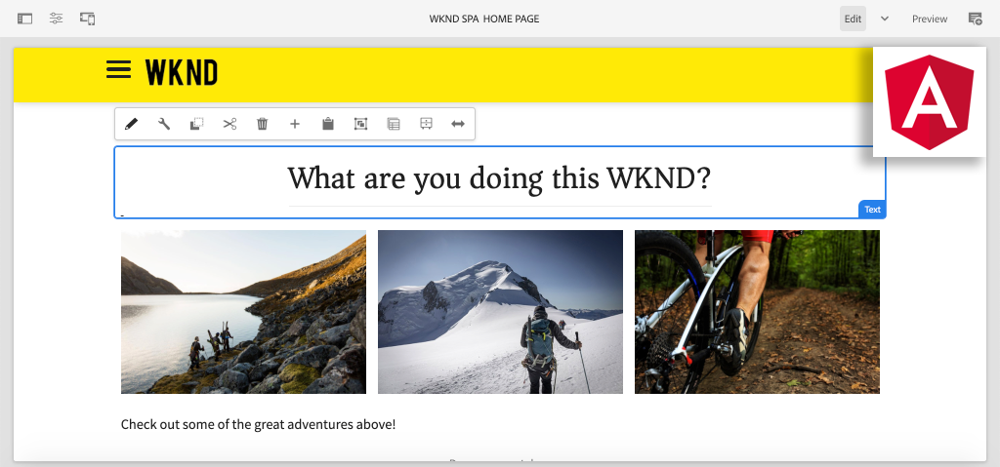

# Skapa din första vinkelräta SPA i AEM {#introduction}

Välkommen till en självstudiekurs i flera delar som utformats för utvecklare som inte har använt **SPA Editor** i Adobe Experience Manager (AEM). Den här självstudiekursen går igenom implementeringen av en Angular-applikation för ett fiktivt livsstilsmärke, WKND. Vinkelappen kommer att utvecklas och utformas för att användas med AEM SPA Editor, som mappar vinkelkomponenter till AEM komponenter. Den kompletta SPA-funktionen, som används för AEM, kan skapas dynamiskt med AEM traditionella textbundna redigeringsverktyg.



*WKND SPA-implementering*

## Om

Målet med den här självstudiekursen är att lära en utvecklare hur man implementerar ett vinkelbaserat program för att arbeta med SPA-redigeringsfunktionen i AEM. I ett verkligt scenario är utvecklingsaktiviteterna uppdelade efter personifiering, ofta med en **Front End-utvecklare** och en **Back End-utvecklare**. Vi anser att det är bra att alla utvecklare som kommer att delta i ett AEM SPA-redigeringsprojekt slutför den här självstudiekursen.

Självstudiekursen är utformad för att fungera med **AEM som Cloud Service** och är bakåtkompatibel med **AEM 6.5.4+** och **AEM 6.4.8+**. SPA implementeras med:

* [Maven AEM Project Archetype](https://docs.adobe.com/content/help/en/experience-manager-core-components/using/developing/archetype/overview.html)
* [AEM SPA Editor](https://docs.adobe.com/content/help/en/experience-manager-65/developing/headless/spas/spa-walkthrough.html#content-editing-experience-with-spa)
* [Kärnkomponenter](https://docs.adobe.com/content/help/en/experience-manager-core-components/using/introduction.html)
* [Vinkel](https://angular.io/)

*Beräkna 1-2 timmar för att komma igenom varje del av självstudiekursen.*

## Senaste kod

All självstudiekod finns på [GitHub](https://github.com/adobe/aem-guides-wknd-spa).

Den [senaste kodbasen](https://github.com/adobe/aem-guides-wknd-spa/releases) är tillgänglig som hämtningsbara AEM.

## Förutsättningar

Innan du startar den här självstudiekursen behöver du följande:

* Grundläggande kunskaper i HTML, CSS och JavaScript
* Grundläggande kännedom om [vinkeln](https://angular.io/)
* [AEM som Cloud Service SDK](https://docs.adobe.com/content/help/en/experience-manager-learn/cloud-service/local-development-environment-set-up/aem-runtime.html#download-the-aem-as-a-cloud-service-sdk), [AEM 6.5.4+](https://helpx.adobe.com/experience-manager/aem-releases-updates.html#65) eller [AEM 6.4.8+](https://helpx.adobe.com/experience-manager/aem-releases-updates.html#64)
* [Java](https://downloads.experiencecloud.adobe.com/content/software-distribution/en/general.html)
* [Apache Maven](https://maven.apache.org/) (3.3.9 eller senare)
* [Node.js](https://nodejs.org/en/) och [npm](https://www.npmjs.com/)

*Även om det inte är nödvändigt är det bra att ha en grundläggande förståelse för hur man[utvecklar traditionella AEM Sites-komponenter](https://docs.adobe.com/content/help/en/experience-manager-learn/getting-started-wknd-tutorial-develop/overview.html).*

## Lokal utvecklingsmiljö {#local-dev-environment}

En lokal utvecklingsmiljö krävs för att slutföra den här självstudiekursen. Skärmbilder och video hämtas med AEM som en Cloud Service-SDK som körs i en Mac OS-miljö med [Visual Studio Code](https://code.visualstudio.com/) som IDE. Kommandon och kod ska vara oberoende av det lokala operativsystemet, om inget annat anges.

>[!NOTE]
>
> **Är du inte AEM som Cloud Service?** Ta en titt på [följande guide för att konfigurera en lokal utvecklingsmiljö med AEM som Cloud Service-SDK](https://docs.adobe.com/content/help/en/experience-manager-learn/cloud-service/local-development-environment-set-up/overview.html).
>
> **Har du inte använt AEM 6.5 tidigare?** Ta en titt på [följande guide för att konfigurera en lokal utvecklingsmiljö](https://docs.adobe.com/content/help/en/experience-manager-learn/foundation/development/set-up-a-local-aem-development-environment.html).

## Nästa steg {#next-steps}

Vad väntar du på?! Starta självstudiekursen genom att gå till kapitlet [SPA Editor Project](create-project.md) och se hur du genererar ett SPA Editor-aktiverat projekt med hjälp av den AEM projektarkitekturen.

## Bakåtkompatibilitet {#compatibility}

Projektkoden för den här självstudiekursen har skapats för AEM som en Cloud Service. Flera ändringar har gjorts för att göra projektkoden bakåtkompatibel för **6.5.4+** och **6.4.8+** .

UberJar [](https://docs.adobe.com/content/help/en/experience-manager-65/developing/devtools/ht-projects-maven.html#what-is-the-uberjar) v6.4.4 **** har inkluderats som ett beroende:

```xml
<!-- Adobe AEM 6.x Dependencies -->
<dependency>
    <groupId>com.adobe.aem</groupId>
    <artifactId>uber-jar</artifactId>
    <version>6.4.4</version>
    <classifier>apis</classifier>
    <scope>provided</scope>
</dependency>
```

Ytterligare en Maven-profil med namnet `classic` har lagts till för att modifiera bygget AEM 6.x-miljöer:

```xml
  <!-- AEM 6.x Profile to include Core Components-->
    <profile>
        <id>classic</id>
        <activation>
            <activeByDefault>false</activeByDefault>
        </activation>
        <build>
        ...
    </profile>
```

Profilen är som standard inaktiverad `classic` . Om du följer självstudiekursen med AEM 6.x kan du lägga till profilen när du får instruktioner om hur du utför en Maven-byggnad: `classic`

```shell
$ mvn clean install -PautoInstallSinglePackage -Pclassic
```

När du genererar ett nytt projekt för en AEM implementering ska du alltid använda den senaste versionen av [AEM Project Archettype](https://github.com/adobe/aem-project-archetype) och uppdatera `aemVersion` så att du har den tänkta versionen av AEM.
