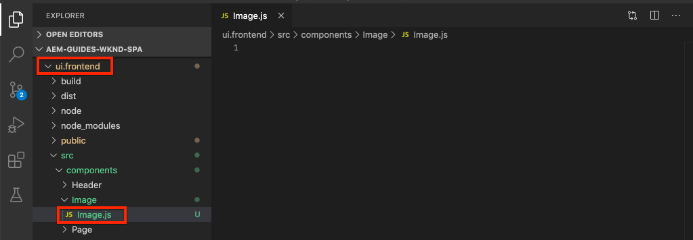

# Mappa SPA komponenter till AEM komponenter {#map-components}

Lär dig hur du mappar React-komponenter till Adobe Experience Manager-komponenter (AEM) med AEM SPA Editor JS SDK. Komponentmappning gör att användare kan göra dynamiska uppdateringar av SPA komponenter i AEM SPA Editor, på samma sätt som vid traditionell AEM.

Det här kapitlet innehåller en djupdykning i AEM JSON-modell-API:t och hur JSON-innehåll som exponeras av en AEM automatiskt kan injiceras i en React-komponent som utkast.

## Syfte

1. Lär dig hur du mappar AEM komponenter till SPA.
2. Förstå skillnaden mellan **Container**-komponenter och **Content**-komponenter.
3. Skapa en ny React-komponent som mappar till en befintlig AEM.

## Vad du ska bygga

I det här kapitlet granskas hur den angivna `Text`-SPA mappas till AEM `Text`komponenten. En ny `Image`-SPA skapas som kan användas i SPA och redigeras i AEM. Funktionerna i **layoutbehållaren** och **mallredigeraren** används också för att skapa en vy som ser lite mer varierad ut.


## Förutsättningar

Granska de verktyg och instruktioner som krävs för att konfigurera en [lokal utvecklingsmiljö](overview.md#local-dev-environment).

### Hämta koden

1. Hämta startpunkten för den här självstudiekursen via Git:

   ```shell
   $ git clone git@github.com:adobe/aem-guides-wknd-spa.git
   $ cd aem-guides-wknd-spa
   $ git checkout React/map-components-start
   ```

2. Distribuera kodbasen till en lokal AEM med Maven:

   ```shell
   $ mvn clean install -PautoInstallSinglePackage
   ```

   Om du använder [AEM 6.x](overview.md#compatibility) lägger du till profilen `classic`:

   ```shell
   $ mvn clean install -PautoInstallSinglePackage -Pclassic
   ```

Du kan alltid visa den färdiga koden på [GitHub](https://github.com/adobe/aem-guides-wknd-spa/tree/React/map-components-solution) eller checka ut koden lokalt genom att växla till grenen `React/map-components-solution`.

## Mappningsmetod

Det grundläggande konceptet är att mappa en SPA till en AEM. AEM komponenter, kör serversidan, exportera innehåll som en del av JSON-modellens API. JSON-innehållet används av SPA, som kör klientsidan i webbläsaren. En 1:1-mappning skapas mellan SPA och en AEM.


*Översikt över mappning av en AEM till en React-komponent*

## Inspect textkomponenten

[AEM Project Archetype](https://github.com/adobe/aem-project-archetype) innehåller en `Text`-komponent som är mappad till AEM [textkomponenten](https://docs.adobe.com/content/help/en/experience-manager-core-components/using/components/text.html). Detta är ett exempel på en **content**-komponent, eftersom den återger *innehåll* från AEM.

Låt oss se hur komponenten fungerar.

### Inspect JSON-modellen

1. Innan du hoppar in i SPA är det viktigt att förstå den JSON-modell som AEM tillhandahåller. Navigera till [Core Component Library](https://www.aemcomponents.dev/content/core-components-examples/library/page-authoring/text.html) och visa sidan för Text-komponenten. Core Component Library innehåller exempel på alla AEM Core Components.
2. Välj fliken **JSON** för ett av exemplen:

   

   Du bör se tre egenskaper: `text`, `richText` och `:type`.

   `:type` är en reserverad egenskap som visar AEM  `sling:resourceType` (eller sökväg). Värdet `:type` är det som används för att mappa AEM till SPA.

   `text` och  `richText` är ytterligare egenskaper som kommer att exponeras för SPA.

### Inspect komponenten Text

1. Öppna en ny terminal och navigera till mappen `ui.frontend` i projektet. Kör `npm install` och sedan `npm start` för att starta **webpack-dev-server**:

   ```shell
   $ cd ui.frontend
   $ npm install
   $ npm start
   ```

   Modulen `ui.frontend` är för närvarande inställd på att använda JSON-modellen [för modellen](./integrate-spa.md#mock-json).

2. Ett nytt webbläsarfönster öppnas för [http://localhost:3000/content/wknd-spa-react/us/en/home.html](http://localhost:3000/content/wknd-spa-react/us/en/home.html)

   

3. I den utvecklingsmiljö du väljer öppnar du AEM för WKND-SPA. Expandera modulen `ui.frontend` och öppna filen `Text.js` under `ui.frontend/src/components/Text/Text.js`:

   

4. Det första området vi ska inspektera är `class Text` på ~40:

   ```js
   class Text extends Component {
   
       get richTextContent() {
           return (<div
                   id={extractModelId(this.props.cqPath)}
                   data-rte-editelement
                   dangerouslySetInnerHTML={{__html: DOMPurify.sanitize(this.props.text)}} />
                   );
       }
   
       get textContent() {
           return <div>{this.props.text}</div>;
       }
   
       render() {
           return this.props.richText ? this.richTextContent : this.textContent;
       }
   }
   ```

   `Text` är en standardreaktionskomponent. Komponenten använder `this.props.richText` för att avgöra om innehållet som ska återges kommer att vara RTF eller oformaterad text. Det faktiska &quot;innehåll&quot; som används kommer från `this.props.text`. För att undvika en potentiell XSS-attack placeras den RTF-text som flödar via `DOMPurify` innan [farligtSetInnerHTML](https://reactjs.org/docs/dom-elements.html#dangerouslysetinnerhtml) används för att återge innehållet. Återkalla egenskaperna `richText` och `text` från JSON-modellen tidigare i övningen.

5. Ta en titt på `TextEditConfig` på ~rad 29:

   ```js
   const TextEditConfig = {
   emptyLabel: 'Text',
   
       isEmpty: function(props) {
           return !props || !props.text || props.text.trim().length < 1;
       }
   };
   ```

   Koden ovan avgör när platshållaren ska återges i AEM redigeringsmiljö. Om metoden `isEmpty` returnerar **true** återges platshållaren.

6. Ta till sist en titt på `MapTo`-anropet på ~rad 62:

   ```js
   export default MapTo('wknd-spa-react/components/text')(Text, TextEditConfig);
   ```

   `MapTo` tillhandahålls av AEM JS SDK (`@adobe/aem-react-editable-components`) SPA Editor. Sökvägen `wknd-spa-react/components/text` representerar `sling:resourceType` för AEM. Den här sökvägen matchas med `:type` som exponeras av JSON-modellen som observerats tidigare. `MapTo` hanterar tolkningen av JSON-modellens svar och skickar rätt värden  `props` till SPA.

   Du hittar AEM `Text`-komponentdefinitionen på `ui.apps/src/main/content/jcr_root/apps/wknd-spa-react/components/text`.

7. Experimentera genom att ändra `mock.model.json`-filen på `ui.frontend/public/mock-content/mock.model.json`. Vid ~rad 62 uppdaterar du det första `Text`-värdet för att använda en **`H1`**- och **`u`**-tagg:

   ```json
       "text": {
           "text": "<h1><u>Hello World!</u></h1>",
           "richText": true,
           ":type": "wknd-spa-react/components/text"
       }
   ```

   Navigera till [http://localhost:3000](http://localhost:3000) för att se effekterna:

   

   Försök att växla egenskapen `richText` mellan **true** / **false** för att se hur återgivningslogiken fungerar.

8. Inspect `Text.scss` på `ui.frontend/src/components/Text/Text.scss`.

   Den här filen lades till av startkodsbasen för det här kapitlet och använder funktionen [Sass](https://sass-lang.com/) som lades till i det föregående kapitlet. Observera variablerna som refereras från `ui.frontend/src/styles/_variables.scss`.

## Skapa bildkomponenten

Skapa sedan en `Image` React-komponent som är mappad till AEM [Image component](https://docs.adobe.com/content/help/en/experience-manager-core-components/using/components/image.html). Komponenten `Image` är ett annat exempel på en **content**-komponent.

### Inspect the JSON

Innan du hoppar in i SPA ska du kontrollera JSON-modellen som finns i AEM.

1. Navigera till [Bildexemplen i Core Component Library](https://www.aemcomponents.dev/content/core-components-examples/library/page-authoring/image.html).

   

   Egenskaperna för `src`, `alt` och `title` används för att fylla i SPA `Image`-komponenten.

   >[!NOTE]
   >
   > Andra bildegenskaper visas (`lazyEnabled`, `widths`) som gör att en utvecklare kan skapa en adaptiv och lazy-loading-komponent. Komponenten som är inbyggd i den här självstudiekursen är enkel och **inte** använder dessa avancerade egenskaper.

2. Återgå till din utvecklingsmiljö och öppna `mock.model.json` på `ui.frontend/public/mock-content/mock.model.json`. Eftersom det här är en ny komponent i vårt projekt måste vi&quot;göra dummy&quot; av Image JSON.

   På ~rad 70 lägger du till en JSON-post för `image`-modellen (glöm inte bort det avslutande kommatecknet `,` efter den andra `text_23828680`) och uppdaterar `:itemsOrder`-arrayen.

   ```json
   ...
   ":items": {
               ...
               "text_23828680": {
                   "text": "<p>Mock Model JSON!</p>",
                   "richText": true,
                   ":type": "wknd-spa-react/components/text"
               },
               "image": {
                   "alt": "Rock Climber in New Zealand",
                   "title": "Rock Climber in New Zealand",
                   "src": "/mock-content/adobestock-140634652.jpeg",
                   ":type": "wknd-spa-react/components/image"
               }
           },
           ":itemsOrder": [
               "text",
               "text_23828680",
               "image"
           ],
   ```

   Projektet innehåller en exempelbild på `/mock-content/adobestock-140634652.jpeg` som kommer att användas med **webpack-dev-server**.

   Du kan visa den fullständiga [mock.model.json här](https://github.com/adobe/aem-guides-wknd-spa/blob/React/map-components-solution/ui.frontend/public/mock-content/mock.model.json).

### Implementera komponenten Bild

1. Skapa sedan en ny mapp med namnet `Image` under `ui.frontend/src/components`.
2. Under mappen `Image` skapar du en ny fil med namnet `Image.js`.

   

3. Lägg till följande `import`-satser i `Image.js`:

   ```js
   import React, {Component} from 'react';
   import {MapTo} from '@adobe/aem-react-editable-components';
   ```

4. Lägg sedan till `ImageEditConfig` för att bestämma när platshållaren ska visas i AEM:

   ```js
   export const ImageEditConfig = {
   
       emptyLabel: 'Image',
   
       isEmpty: function(props) {
           return !props || !props.src || props.src.trim().length < 1;
       }
   };
   ```

   Platshållaren visas om egenskapen `src` inte är inställd.

5. Implementera sedan klassen `Image`:

   ```js
    export default class Image extends Component {
   
       get content() {
           return ;
       }
   
       render() {
           if(ImageEditConfig.isEmpty(this.props)) {
               return null;
           }
   
           return (
                   <div className="Image">
                       {this.content}
                   </div>
           );
       }
   }
   ```

   Ovanstående kod återger ett `` baserat på de avsteg `src`, `alt` och `title` som skickas av JSON-modellen.

6. Lägg till `MapTo`-koden för att mappa React-komponenten till AEM:

   ```js
   MapTo('wknd-spa-react/components/image')(Image, ImageEditConfig);
   ```

   Observera att strängen `wknd-spa-react/components/image` motsvarar platsen för AEM i `ui.apps` vid: `ui.apps/src/main/content/jcr_root/apps/wknd-spa-react/components/image`.

7. Skapa en ny fil med namnet `Image.scss` i samma katalog och lägg till följande:

   ```scss
   .Image-src {
       margin: 1rem 0;
       width: 100%;
       border: 0;
   }
   ```

8. I `Image.js` lägger du till en referens till filen längst upp under `import`-programsatserna:

   ```js
   import React, {Component} from 'react';
   import {MapTo} from '@adobe/aem-react-editable-components';
   
   require('./Image.scss');
   ```

   Du kan visa den färdiga [Image.js här](https://github.com/adobe/aem-guides-wknd-spa/blob/React/map-components-solution/ui.frontend/src/components/Image/Image.js).

9. Öppna filen `ui.frontend/src/components/import-components.js` och lägg till en referens till den nya `Image`-komponenten:

   ```js
   import './Page/Page';
   import './Text/Text';
   import './Image/Image'; //add reference to Image component
   ```

10. Om den inte redan har startats startar du **webpack-dev-server**. Gå till [http://localhost:3000](http://localhost:3000) och se bildåtergivningen:

   

   >[!NOTE]
   >
   > **Bonusutmaning**: Implementera en ny metod i  `Image.js` för att visa värdet för  `this.props.title` som en bildtext under bilden.

## Uppdatera principer i AEM

Komponenten `Image` är bara synlig i **webpack-dev-server**. Distribuera sedan den uppdaterade SPA för att AEM och uppdatera mallprofilerna.

1. Stoppa **webpack-dev-server** och från projektets rot distribuera ändringarna till AEM med dina Maven-kunskaper:

   ```shell
   $ cd aem-guides-wknd-spa
   $ mvn clean install -PautoInstallSinglePackage
   ```

2. Navigera från AEM startskärm till **Verktyg** > **Mallar** > **[WKND SPA React](http://localhost:4502/libs/wcm/core/content/sites/templates.html/conf/wknd-spa-react)**.

   Markera och redigera **SPA sida**:

   

3. Markera **layoutbehållaren** och klicka på ikonen **policy** för att redigera profilen:

   

4. Under **Tillåtna komponenter** > **WKND SPA React - Content** > kontrollerar du **Image**-komponenten:

   

   Under **Standardkomponenter** > **Lägg till mappning** och välj komponenten **Bild - WKND SPA React - Innehåll**:

   

   Ange **mime type** `image/*`.

   Klicka på **Klar** för att spara principuppdateringarna.

5. I **layoutbehållaren** klickar du på ikonen **policy** för komponenten **Text**:

   

   Skapa en ny princip med namnet **WKND SPA Text**. Under **Plugins** > **Formatering** > markerar du alla rutor för att aktivera ytterligare formateringsalternativ:

   

   Under **Plugins** > **Styckeformat** > markerar du kryssrutan till **Aktivera styckeformat**:

   

   Klicka på **Klar** för att spara principuppdateringen.

6. Gå till **startsidan** [http://localhost:4502/editor.html/content/wknd-spa-react/us/en/home.html](http://localhost:4502/editor.html/content/wknd-spa-react/us/en/home.html).

   Du bör också kunna redigera komponenten `Text` och lägga till ytterligare styckeformat i **helskärmsläge**-läge.

   

7. Du bör också kunna dra och släppa en bild från **Resurssökaren**:

   

8. Lägg till egna bilder via [AEM Assets](http://localhost:4502/assets.html/content/dam) eller installera den färdiga kodbasen för [WKND-referensplatsen](https://github.com/adobe/aem-guides-wknd/releases/latest). [WKND-referensplatsen](https://github.com/adobe/aem-guides-wknd/releases/latest) innehåller många bilder som kan återanvändas i WKND-SPA. Paketet kan installeras med [AEM Package Manager](http://localhost:4502/crx/packmgr/index.jsp).

   

## Inspect layoutbehållaren

Stöd för **layoutbehållaren** tillhandahålls automatiskt av AEM SDK för SPA. **Layoutbehållaren**, som anges med namnet, är en **container**-komponent. Behållarkomponenter är komponenter som accepterar JSON-strukturer som representerar *andra*-komponenter och instansierar dem dynamiskt.

Låt oss inspektera layoutbehållaren ytterligare.

1. I en webbläsare går du till [http://localhost:4502/content/wknd-spa-react/us/en.model.json](http://localhost:4502/content/wknd-spa-react/us/en.model.json)

   

   Komponenten **Layoutbehållare** har `sling:resourceType` `wcm/foundation/components/responsivegrid` och känns igen av SPA Editor med egenskapen `:type`, precis som komponenterna `Text` och `Image`.

   Samma funktioner för att ändra storlek på en komponent med [Layoutläge](https://docs.adobe.com/content/help/en/experience-manager-65/authoring/siteandpage/responsive-layout.html#defining-layouts-layout-mode) finns i SPA Editor.

2. Gå tillbaka till [http://localhost:4502/editor.html/content/wknd-spa-react/us/en/home.html](http://localhost:4502/editor.html/content/wknd-spa-react/us/en/home.html). Lägg till ytterligare **Image**-komponenter och försök ändra storlek på dem med alternativet **Layout**:

   

3. Öppna JSON-modellen [http://localhost:4502/content/wknd-spa-react/us/en.model.json](http://localhost:4502/content/wknd-spa-react/us/en.model.json) igen och observera `columnClassNames` som en del av JSON:

   

   Klassnamnet `aem-GridColumn--default--4` anger att komponenten ska vara 4 kolumner bred baserat på ett 12-kolumnstödraster. Mer information om [responsivt rutnät finns här](https://adobe-marketing-cloud.github.io/aem-responsivegrid/).

4. Återgå till IDE och i modulen `ui.apps` finns det ett klientbibliotek definierat på `ui.apps/src/main/content/jcr_root/apps/wknd-spa-react/clientlibs/clientlib-grid`. Öppna filen `less/grid.less`.

   Den här filen avgör vilka brytpunkter (`default`, `tablet` och `phone`) som används av **layoutbehållaren**. Den här filen är avsedd att anpassas efter projektspecifikationer. För närvarande är brytpunkterna inställda på `1200px` och `650px`.

5. Du bör kunna använda de responsiva funktionerna och de uppdaterade reglerna för formaterad text i `Text`-komponenten för att skapa en vy som följande:

   

## Grattis! {#congratulations}

Grattis! Du lärde dig att mappa SPA till AEM komponenter och du implementerade en ny `Image`-komponent. Du har också en chans att utforska de responsiva funktionerna i **layoutbehållaren**.

Du kan alltid visa den färdiga koden på [GitHub](https://github.com/adobe/aem-guides-wknd-spa/tree/React/map-components-solution) eller checka ut koden lokalt genom att växla till grenen `React/map-components-solution`.

### Nästa steg {#next-steps}

[Navigering och routning](navigation-routing.md)  - Lär dig hur flera vyer i SPA kan användas genom att mappa till AEM sidor med SPA Editor SDK. Dynamisk navigering implementeras med React Router och läggs till i en befintlig Header-komponent.

## Bonus - Beständiga konfigurationer till källkontrollen {#bonus}

I många fall, särskilt i början av ett AEM projekt, är det viktigt att behålla konfigurationer som mallar och relaterade innehållsprinciper för källkontroll. Detta garanterar att alla utvecklare arbetar mot samma uppsättning innehåll och konfigurationer och kan säkerställa ytterligare enhetlighet mellan miljöer. När ett projekt når en viss mognadsnivå kan rutinen med mallhantering överföras till en särskild grupp med avancerade användare.

Nästa steg kommer att utföras med Visual Studio Code IDE och [VSCode AEM Sync](https://marketplace.visualstudio.com/items?itemName=yamato-ltd.vscode-aem-sync), men kan utföras med alla verktyg och alla IDE som du har konfigurerat att **pull** eller **importera**-innehåll från en lokal instans av AEM.

1. I Visual Studio Code IDE kontrollerar du att du har **VSCode AEM Sync** installerat via Marketplace-tillägget:

   

2. Expandera modulen **ui.content** i Project Explorer och navigera till `/conf/wknd-spa-react/settings/wcm/templates`.

3. **Högerklicka** på  `templates` mappen och välj  **Importera från AEM Server**:

   

4. Upprepa stegen för att importera innehåll men välj mappen **policies** på `/conf/wknd-spa-react/settings/wcm/templates/policies`.

5. Inspect filen `filter.xml` på `ui.content/src/main/content/META-INF/vault/filter.xml`.

   ```xml
   <!--ui.content filter.xml-->
   <?xml version="1.0" encoding="UTF-8"?>
    <workspaceFilter version="1.0">
        <filter root="/conf/wknd-spa-react" mode="merge"/>
        <filter root="/content/wknd-spa-react" mode="merge"/>
        <filter root="/content/dam/wknd-spa-react" mode="merge"/>
        <filter root="/content/experience-fragments/wknd-spa-react" mode="merge"/>
    </workspaceFilter>
   ```

   Filen `filter.xml` identifierar sökvägarna till noder som ska installeras med paketet. Observera `mode="merge"` för varje filter som anger att befintligt innehåll inte ändras, endast nytt innehåll läggs till. Eftersom innehållsförfattare kan uppdatera dessa sökvägar är det viktigt att en koddistribution **inte** skriver över innehåll. Mer information om hur du arbetar med filterelement finns i [dokumentationen för FileVault](https://jackrabbit.apache.org/filevault/filter.html).

   Jämför `ui.content/src/main/content/META-INF/vault/filter.xml` och `ui.apps/src/main/content/META-INF/vault/filter.xml` för att förstå de olika noder som hanteras av varje modul.
